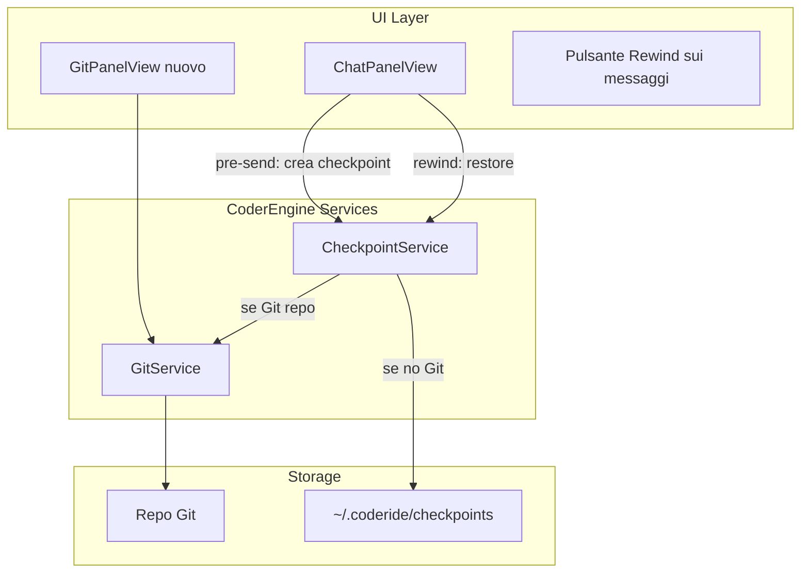

# Piano: Git e Checkpoint per Codigo

## Contesto

**Stato attuale**: Codigo non ha integrazione Git né checkpoint per revert. Codex CLI e Claude CLI sono usati in modalità headless (`codex exec`, `claude -p`) e **non espongono checkpoint nativi** nello stream. La documentazione suggerisce Git manuale per undo.

**Approcci di riferimento**:

- **Conductor** (Claude): Git hooks che committano lo stato su un ref privato prima di ogni risposta AI
- **Claude Code TUI**: Checkpoint automatici (user prompt = checkpoint), `/rewind` per restore — non disponibile in headless
- **Codex**: Nessun checkpoint; consiglia branch + commit frequenti + `git checkout`

## Architettura proposta




---

## Parte 1: Integrazione Git

### 1.1 GitService (CoderEngine)

Nuovo modulo `[CoderEngine/Sources/CoderEngine/Git/GitService.swift](CoderEngine/Sources/CoderEngine/Git/GitService.swift)` che invoca `git` via `ProcessRunner`:


| Metodo               | Comando                               | Uso                              |
| -------------------- | ------------------------------------- | -------------------------------- |
| `isGitRepo(path)`    | `git rev-parse --is-inside-work-tree` | Verifica se è un repo            |
| `status(path)`       | `git status --porcelain=v2 -z`        | File modificati/staged/untracked |
| `diff(path, staged)` | `git diff [--cached]`                 | Differenze                       |
| `stage(paths)`       | `git add`                             | Stage file                       |
| `unstage(paths)`     | `git reset`                           | Unstage                          |
| `commit(message)`    | `git commit -m`                       | Commit                           |
| `branches()`         | `git branch -a`                       | Liste branch                     |
| `currentBranch()`    | `git branch --show-current`           | Branch attuale                   |
| `checkout(ref)`      | `git checkout`                        | Cambio ref                       |
| `initRepo(path)`     | `git init`                            | Inizializza repo                 |
| `remoteStatus()`     | `git fetch` + `git status`            | Sync con remoto                  |


**Nota**: Nessuna dipendenza esterna (SwiftGit2, libgit2). Uso di `ProcessRunner.runCollecting` per eseguire `git` — approccio robusto e senza linking nativo.

### 1.2 UI Git

- **Pannello Git** in sidebar o come tab nel ContentView (affiancabile a Editor/Terminale)
- **Indicatore stato** nella barra contesto (branch, modifiche non commitate)
- **Azioni**: Stage/Unstage, Commit con messaggio, Init se non è repo

File principali:

- `[Sources/CoderIDE/GitPanelView.swift](Sources/CoderIDE/GitPanelView.swift)` — lista file, diff, pulsanti stage/commit
- `[Sources/CoderIDE/GitStatusStore.swift](Sources/CoderIDE/GitStatusStore.swift)` — `@Published` per status, diff, branch
- Estensione `[ContentView.swift](Sources/CoderIDE/ContentView.swift)` — tab Git quando workspace ha contesto

---

## Parte 2: Sistema Checkpoint

### 2.1 Modello Checkpoint

Checkpoint = snapshot dello stato del workspace **prima** che l’agente risponda a un messaggio utente.

```swift
struct Checkpoint: Identifiable, Codable {
    let id: UUID
    let conversationId: UUID
    let messageIndex: Int           // indice del messaggio user cui il checkpoint precede la risposta
    let createdAt: Date
    let workspacePaths: [String]    // path root del workspace
    let gitCommitSha: String?       // se repo Git
    let snapshotDir: String?         // se no Git: path a ~/.coderide/checkpoints/...
}
```

### 2.2 Strategia duale


| Condizione           | Strategia     | Dettagli                                                                                                                                   |
| -------------------- | ------------- | ------------------------------------------------------------------------------------------------------------------------------------------ |
| Workspace è repo Git | **Git-based** | Commit su branch `coderide-checkpoints/<conv_id>` con messaggio `coderide:pre:<msg_index>`                                                 |
| Workspace non è repo | **Snapshot**  | Copia file in `~/.coderide/checkpoints/<conv_id>/<msg_index>/` (solo file tracciati da WorkspaceScanner, esclusi .git, node_modules, ecc.) |


**Git-based** (ispirato a Conductor):

- Branch dedicato `coderide-checkpoints/<conversation_id>` (ref breve)
- Prima di ogni `sendMessage`: `git add -A` (solo path workspace), `git commit -m "coderide:pre:N"` su quel branch
- Al restore: `git checkout -f <commit_sha>` o `git reset --hard <sha>` sul branch principale

**Snapshot**:

- Directory `~/.coderide/checkpoints/<conv_id>/<msg_index>/`
- Copia ricorsiva dei file nel workspace (rispettando excludedPaths)
- Restore: sovrascrivere i file attuali con le copie

### 2.3 CheckpointService (CoderEngine)

`[CoderEngine/Sources/CoderEngine/Checkpoint/CheckpointService.swift](CoderEngine/Sources/CoderEngine/Checkpoint/CheckpointService.swift)`:

- `createCheckpoint(conversationId, messageIndex, workspacePaths, excludedPaths) async throws -> Checkpoint`  
  - Se Git: branch + commit  
  - Altrimenti: snapshot su disco
- `listCheckpoints(conversationId) async throws -> [Checkpoint]`  
  - Da metadati in `~/.coderide/checkpoints/<conv_id>/manifest.json`
- `restore(checkpoint) async throws`  
  - Se Git: checkout/reset  
  - Altrimenti: restore da snapshot
- `deleteCheckpoints(conversationId, afterMessageIndex)` — cleanup dopo restore

### 2.4 Integrazione nel flusso Chat

1. **Pre-send** (in `[ChatPanelView.sendMessage](Sources/CoderIDE/ChatPanelView.swift)` e `executeGenericQuestionResponse`):
  Subito prima di chiamare `provider.send()`, invocare `CheckpointService.createCheckpoint()` con `messageIndex` = indice del messaggio user appena aggiunto.
2. **UI Rewind**:
  Su ogni messaggio **user** nella chat, mostrare un’icona "rewind" al hover (come Conductor).  
   Click → conferma → `CheckpointService.restore(checkpoint)` + `ChatStore.removeMessagesFrom(conversationId, fromIndex: messageIndex + 1)`.

### 2.5 CheckpointStore (UI)

- `[Sources/CoderIDE/CheckpointStore.swift](Sources/CoderIDE/CheckpointStore.swift)`: cache in memoria dei checkpoint per conversazione, caricati on-demand
- Collegamento a `ChatStore` per refresh dopo restore

---

## Parte 3: Standardizzazione e allineamento con Codex/Claude

- **Formato unico**: Tutti i checkpoint sono gestiti da Codigo, indipendentemente dal provider.
- **Compatibilità**: Se in futuro Codex o Claude espongono API di checkpoint, si può aggiungere un adapter che popola lo stesso `Checkpoint` model.
- **Convenzione agent_question**: L’opzione `back:N` nella convenzione esistente (es. `uncommitted|staged|back:3|main`) si riferisce al **contesto del diff** da inviare, non ai checkpoint. I checkpoint restano separati e gestiti solo dall’UI.

---

## Parte 4: Implementazione consigliata

1. **GitService** + unit test (status, diff, stage, commit, init)
2. **CheckpointService** con strategia Git (priorità per progetti Git)
3. **CheckpointService** con strategia Snapshot per workspace non-Git
4. **CheckpointStore** + integrazione pre-send in ChatPanelView
5. **UI Rewind** (icona sui messaggi user, sheet di conferma)
6. **GitPanelView** + GitStatusStore
7. **Tab Git** in ContentView
8. **Cleanup** checkpoint vecchi (es. retention 30 giorni, come Claude)

---

## File da creare/modificare


| Azione   | File                                                                              |
| -------- | --------------------------------------------------------------------------------- |
| Crea     | `CoderEngine/Sources/CoderEngine/Git/GitService.swift`                            |
| Crea     | `CoderEngine/Sources/CoderEngine/Checkpoint/CheckpointService.swift`              |
| Crea     | `CoderEngine/Sources/CoderEngine/Checkpoint/Checkpoint.swift`                     |
| Crea     | `Sources/CoderIDE/GitPanelView.swift`                                             |
| Crea     | `Sources/CoderIDE/GitStatusStore.swift`                                           |
| Crea     | `Sources/CoderIDE/CheckpointStore.swift`                                          |
| Modifica | `Sources/CoderIDE/ChatPanelView.swift` — pre-send checkpoint, UI rewind           |
| Modifica | `Sources/CoderIDE/ClickableMessageContent.swift` — icona rewind su messaggi user  |
| Modifica | `Sources/CoderIDE/ContentView.swift` — tab Git                                    |
| Modifica | `Sources/CoderIDE/ChatStore.swift` — `removeMessagesFrom(fromIndex:)` per restore |


---

## Considerazioni

- **Workspace multi-path**: Per workspace con più cartelle, si considera repo Git la prima cartella che contiene `.git`; in caso di ad-hoc paths multipli, si usa snapshot.
- **Concorrenza**: Evitare due chat attive sullo stesso workspace mentre si usa rewind (come Conductor).
- **Codex `--skip-git-repo-check`**: Rimane utile per exec senza repo; i checkpoint snapshot coprono quel caso.

