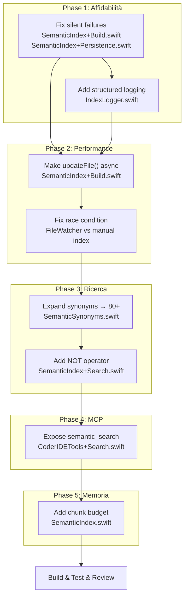

## Plan: Hardening e Miglioramento del Pipeline SemanticIndex + Codebase Search

### Contesto
L'analisi approfondita del flusso InstantGrep → Codebase Index → Semantic Search ha rivelato che il sistema funziona come progettato, ma presenta lacune critiche in affidabilità (errori silenziosi), performance (I/O bloccante), e capacità di ricerca (sinonimi limitati, nessun operatore query). Il piano si concentra sui fix ad alto impatto che migliorano stabilità e qualità della ricerca senza stravolgere l'architettura BM25 esistente.

### Approccio
1. **Fix affidabilità** — Aggiungere logging strutturato e error handling dove oggi ci sono `try?` silenziosi
2. **Fix performance** — Rendere `updateFile()` async e proteggere la race condition FileWatcher/indexing
3. **Miglioramento ricerca** — Espandere il sistema sinonimi (da 25 a 80+), aggiungere operatori query base (AND, NOT)
4. **Esposizione MCP** — Esporre `semantic_search` come tool MCP per gli agenti
5. **Protezione memoria** — Aggiungere budget massimo per chunk in memoria

### Trade-offs
- **Embeddings neurali NON inclusi** — Richiederebbero dipendenza esterna (OpenAI API o modello locale), vector store (FAISS/SQLite-vec), e un redesign significativo. Il BM25 con euristiche copre bene l'80% dei casi d'uso. Gli embeddings sono un'evoluzione futura, non un fix.
- **Operatori query limitati** — Si aggiungono solo AND (default) e NOT (prefisso `-`). OR e fuzzy matching sono complessità non necessaria ora.
- **Sinonimi ancora hardcoded** — Un file di configurazione esterno sarebbe over-engineering. Si estende la mappa inline ma la si sposta in un file dedicato per manutenibilità.

### Architettura

## Todo
- [ ] Aggiungere logging strutturato nei punti di fallimento silenzioso: `SemanticIndex+Build.swift:44` (loadFromDisk), `SemanticIndex+Persistence.swift:26,36` (save/load JSONL), estrarre logger in `IndexLogger.swift` (max 100 righe)
- [ ] Rendere `updateFile()` async in `SemanticIndex+Build.swift:118` — usare async file I/O per evitare blocco dell'actor thread, aggiornare tutti i call site
- [ ] Proteggere race condition FileWatcher vs indexing manuale: aggiungere flag `isIndexing` con lock in `CodebaseIndex.swift`, skip eventi FileWatcher durante indexWorkspace
- [ ] Espandere il sistema sinonimi da 25 a 80+ mappature: estrarre in file dedicato `SemanticSynonyms.swift` (max 200 righe) con categorie (auth, data, UI, networking, errors, lifecycle)
- [ ] Aggiungere operatore NOT alla query: prefisso `-` per escludere token (es. `auth -oauth`) in `SemanticIndex+Search.swift`, filtrare chunk che contengono token negati
- [ ] Esporre `semantic_search` come tool MCP in `CoderIDETools+Search.swift` — registrare con schema (query, target_directories, num_results), delegare a `SemanticIndex.search()`
- [ ] Aggiungere budget memoria chunk: limite configurabile (default 50K chunk) in `SemanticIndex.swift`, eviction LRU quando superato, log warning al 80% capacità
- [ ] Build, test, code review: compilare il progetto, verificare che l'indice si costruisca correttamente, testare ricerca con sinonimi espansi e operatore NOT, review del codice per qualità e sicurezza
