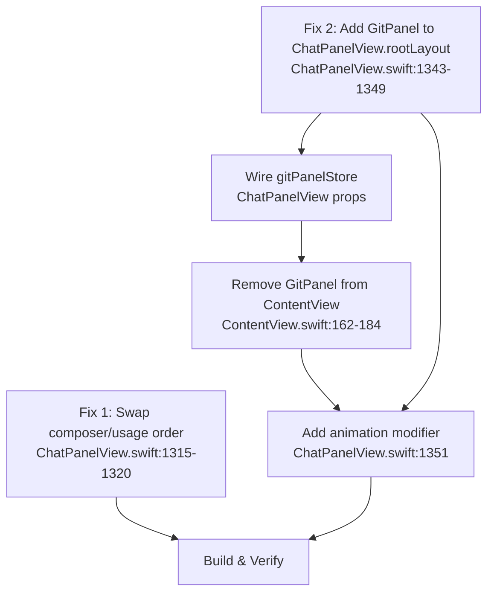

## Plan: Fix UsageFooter ordering e Git panel in agent mode

### Problema 1 — UsageFooterView sopra il composer
Nel commit `8287262` l'ordine di `usageFooterArea` e `composerArea` è stato invertito nel VStack di `rootLayout` in `ChatPanelView.swift` (righe 1315-1320). Prima c'era composer → usage, ora c'è usage → composer. Basta scambiare i due blocchi `if` per ripristinare l'ordine corretto.

### Problema 2 — Git panel non si apre in agent mode
Il `GitPanelView` è renderizzato **solo** dentro il blocco IDE mode di `ContentView.swift` (riga 163). In agent mode (riga 209-214) il layout contiene solo `chatPanel` senza alcun rendering del git panel. La soluzione migliore è aggiungere il `GitPanelView` come side panel dentro `ChatPanelView.rootLayout`, accanto a Plan/Debug/Swarm/CodeReview (righe 1322-1349). Questo lo rende visibile in **tutti** i mode (agent, browser, ide) in modo coerente con gli altri pannelli. Per evitare duplicazione in IDE mode, si rimuove il git panel dal blocco IDE di `ContentView`.

### Trade-offs
- **Alternativa scartata**: aggiungere il git panel direttamente nel blocco agent mode di `ContentView`. Meno pulito perché duplicherebbe il codice in 2 posti (IDE + agent) e non coprirebbe browser mode.
- **Approccio scelto**: spostare il git panel in `ChatPanelView.rootLayout` — un solo punto di rendering, funziona in tutti i mode, consistente con gli altri pannelli.

## Todo
- [ ] Scambiare ordine `usageFooterArea` / `composerArea` in `ChatPanelView.swift:1315-1320` — ripristinare composer prima, usage dopo
- [ ] Aggiungere `GitPanelView` come side panel in `ChatPanelView.rootLayout` (dopo CodeReview, righe 1343-1349), con `PanelResizeHandle` e condizione `gitPanelStore.isOpen`
- [ ] Verificare/aggiungere accesso a `gitPanelStore` in `ChatPanelView` — passare via `@EnvironmentObject` o parametro init se non già disponibile
- [ ] Rimuovere il blocco `GitPanelView` da `ContentView.swift:162-184` (blocco IDE mode) per evitare duplicazione
- [ ] Aggiungere `.animation(.none, value: gitPanelStore.isOpen)` coerente con gli altri pannelli in `ChatPanelView.rootLayout`
- [ ] Build & verifica: compilare, testare toggle del git panel in agent mode, verificare ordine usage/composer
