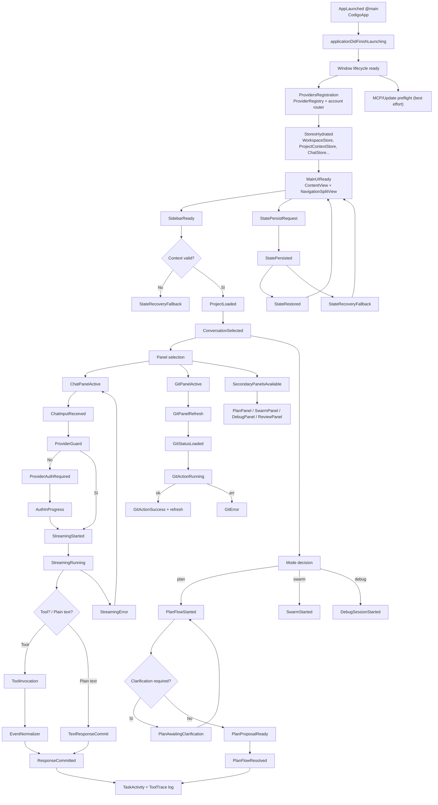
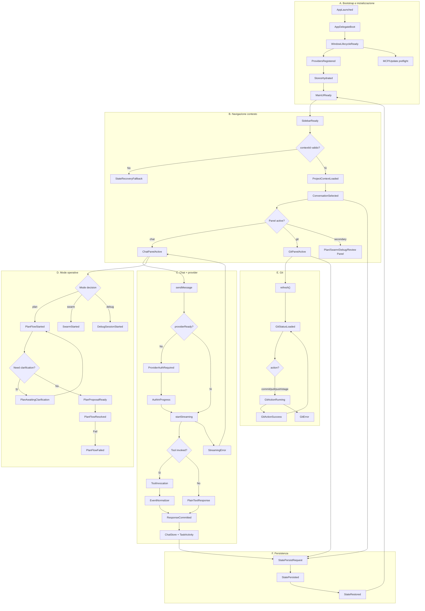

# App flow ufficiale (v2, codice reale + guardie)

## 1) Mappa macro dei flussi principali

- Bootstrap & readiness: `AppLaunched -> AppDelegateBoot -> StoresHydrated -> MainUIReady`
- Contesto e navigazione: `Workspace/Project loaded -> Conversation selected -> Panel selection`
- Chat + provider: `sendMessage -> ProviderGuard -> Streaming -> Tool/Text response -> ResponseCommitted`
- Modalità operative: `Mode decision -> Plan/Swarm/Debug` con transizioni dedicate
- Git: `GitPanel open -> Refresh -> Action -> Refresh/Error`
- Persistenza: `StatePersistRequest -> StatePersisted -> StateRestored / StateRecoveryFallback`

## 2) Diagramma livello 1 (macro flow)

## 3) Diagramma livello 2 (dettaglio sottosistemi critici)

## 4) Flusso → Moduli → output (matrice)

| Flusso | Moduli principali | Trigger | Stato/Output osservabile |
| --- | --- | --- | --- |
| Bootstrap | `CoderIDEApp`, `AppDelegate`, provider registry | Avvio app | `AppLaunched`, `ProvidersRegistered`, `StoresHydrated`, `MainUIReady` |
| Contesto | `ContentView`, `SidebarView`, `WorkspaceStore`, `ProjectContextStore` | cambio workspace/thread | `ProjectLoaded`, `ConversationSelected`, `Panel selection` |
| Chat/LLM | `ChatPanelView`, `ConversationFlowCoordinator`, `EventNormalizer`, `ChatStore` | invio messaggio | `MessageQueued`, `StreamingRunning`, `ToolInvocation`, `ResponseCommitted` |
| Provider auth | `CLIAccountRouter`, `CLIMultiAccountProviderAdapter`, `CLIAccountLoginCoordinator`, `ProfileSwitcher` | send con provider non autenticato | `ProviderAuthRequired`, `AuthInProgress`, `ProviderAuthenticated`, `AuthError` |
| Plan/swarm/debug | `ModeControlsBarView`, `PlanPanelView`, `SwarmPanel`, `DebugPanelView` | cambio mode | `ModeSelected`, `PlanFlowStarted`, `PlanFlowResolved/Failed`, `SwarmStarted`, `DebugSessionStarted` |
| Git | `GitPanelView`, `GitPanelStore`, `GitService` | open/git action | `GitStatusLoaded`, `GitActionRunning`, `GitActionSuccess`, `GitError` |
| Persistenza | `WorkspaceStore`, `ProjectContextStore`, defaults/local state | chiusura/switch | `StatePersisted`, `StateRestored`, `StateRecoveryFallback` |

## 5) Out of scope

- Micro-UI dei singoli componenti non proprietari.
- Implementazioni interne di librerie esterne (SDK LLM, runtime shell/git/MCP non proprietario).
- Dettagli di toolchain CI/build pipeline non parte del flusso runtime utente.

## 6) Nota per integrazione successiva

- I nodi con fallback sono mantenuti espliciti per migliorare troubleshooting e onboarding.
- Le decision point (`providerReady?`, `contextId valido?`, `tool?`, `Mode`, `Git action?`) sono tratte dai flussi osservati in runtime.
