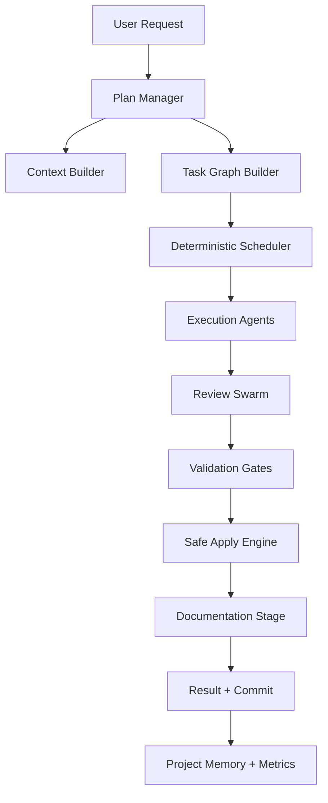
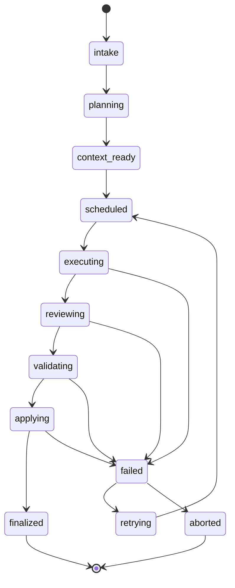

# SoloCode Pipeline v2.1

Data: 2026-03-05  
Stato: Specifica operativa completa  
Obiettivo: pipeline AI engineering stile Cursor, deterministica, robusta, provider-agnostic (CLI + API), con orchestrator centrale

## 0. Convenzioni normative

In questo documento:

- `MUST`: obbligatorio
- `SHOULD`: fortemente raccomandato
- `MAY`: opzionale

Le regole `MUST` sono vincoli di sistema e di CI.

## 1. Scope

Questa specifica copre:

1. architettura end-to-end della pipeline;
2. processi di esecuzione fase per fase;
3. catalogo completo tool MCP usati nel flusso;
4. contratti dati (job/task/patch/review/memory);
5. algoritmi di orchestrazione (DAG, scheduler, lock, apply);
6. strategia provider CLI + API;
7. quality gates (review/test/docs/security/size);
8. piano implementativo concreto con struttura file.

Non copre:

1. UI pixel-level design;
2. dettagli cloud multi-tenant;
3. billing/accounting avanzato provider.

## 2. Principi invarianti

1. `Orchestrator authority`: solo l'orchestrator decide ordine, retry, apply e chiusura task.
2. `Task determinism`: task con input/output tipizzati, idempotenti quando possibile.
3. `Patch-first`: niente rewrite completo salvo casi espliciti e tracciati.
4. `Safe concurrency`: lock file-set + fairness + lease + timeout.
5. `Mandatory quality`: ogni mutazione deve passare review + test.
6. `Auditability`: ogni decisione e ogni patch sono tracciate.
7. `Provider neutrality`: routing per capability, non per nome provider.
8. `Small modules`: target `<300` LOC/file, hard block `>500`.

## 3. Baseline reale del repository

Capacità già presenti:

1. `FileLockCoordinator` con lease/fairness/backoff.
2. `CodeReviewMultiSwarmProvider` con fix/test/re-review loop.
3. `ToolEnabledLLMProvider` con gate obbligatorio reviewer + testWriter post-mutation.
4. catalogo MCP esteso (plan/subagent/review/debug/todo/search/file ops).
5. provider factory multi-backend CLI/API.

Gap tecnici principali:

1. write-subagent CLI oggi è codex-first (Claude read-only, Gemini non idoneo write-safe nel path subagent).
2. manca un apply engine transazionale unico con patch manifest formale.
3. manca enforcement CI hard del limite `<300` e blocco `>500`.
4. manca schema persistente standard per job DAG + resume automatico.

## 4. Architettura target



Componenti logici:

1. `Plan Manager`
2. `Context Builder`
3. `Task Graph Builder`
4. `Scheduler`
5. `Execution Layer`
6. `Review Layer`
7. `Validation Layer`
8. `Apply Engine`
9. `Memory & Observability`

## 5. State machine globale



Stati terminali:

1. `finalized`
2. `aborted`

## 6. Contratti dati obbligatori

## 6.1 `pipeline_job.json`

```json
{
  "job_id": "job_20260305_001",
  "workspace": "/abs/path/repo",
  "request": "testo richiesta utente",
  "mode": "strict",
  "created_at": "2026-03-05T15:00:00Z",
  "state": "planning",
  "policy_version": "v2.1",
  "selected_provider_profile": "default",
  "plan_snapshot_id": "plan_123"
}
```

Campi minimi:

1. `job_id`
2. `workspace`
3. `request`
4. `mode`
5. `state`

## 6.2 `task_node.json`

```json
{
  "task_id": "T3",
  "title": "Refactor parser lock handling",
  "depends_on": ["T1", "T2"],
  "priority": 70,
  "risk": "medium",
  "file_scope": ["Sources/A.swift", "Sources/B.swift"],
  "status": "pending",
  "attempts": 0,
  "max_attempts": 3
}
```

## 6.3 `patch_manifest.json`

```json
{
  "patch_id": "p_abc123",
  "job_id": "job_20260305_001",
  "task_id": "T3",
  "provider": "codex-cli",
  "agent_role": "coder",
  "touched_files": ["Sources/A.swift"],
  "unified_diff_path": "artifacts/patches/p_abc123.diff",
  "risk_score": 0.42,
  "created_at": "2026-03-05T15:07:30Z",
  "status": "proposed"
}
```

## 6.4 `review_session.json`

```json
{
  "session_id": "rev_987",
  "scope": "uncommitted",
  "max_workers": 6,
  "max_rounds": 3,
  "analysis_backend": "codex",
  "execution_backend": "codex",
  "phase": "reviewing",
  "findings_count": 4
}
```

## 6.5 `provider_capability_matrix.json`

```json
{
  "providers": [
    {
      "id": "codex-cli",
      "supports_readonly_subagent": true,
      "supports_write_subagent": true,
      "supports_workspace_sandbox": true,
      "supports_native_tools": true
    },
    {
      "id": "claude-cli",
      "supports_readonly_subagent": true,
      "supports_write_subagent": false,
      "supports_workspace_sandbox": false,
      "supports_native_tools": true
    }
  ]
}
```

## 6.6 `project_memory.json`

```json
{
  "workspace": "/abs/path/repo",
  "coding_standards": ["swiftlint strict", "no giant files"],
  "naming_rules": ["camelCase functions", "PascalCase types"],
  "forbidden_patterns": ["force unwrap in production paths"],
  "architecture_notes": ["adapter layer mandatory for external APIs"],
  "last_updated_at": "2026-03-05T15:00:00Z"
}
```

## 6.7 `event_log.ndjson`

Ogni evento MUST essere append-only:

```json
{"ts":"2026-03-05T15:00:05Z","job_id":"job_1","phase":"planning","event":"plan_created"}
{"ts":"2026-03-05T15:01:10Z","job_id":"job_1","phase":"executing","event":"subagent_started","role":"explorer"}
```

## 7. Modalità operative

## 7.1 `strict` (default)

1. i subagent write producono patch proposal;
2. apply solo orchestrator;
3. nessun commit finché non passano tutti i gate.

## 7.2 `fast` (controllata)

1. subagent write possono mutare in sandbox;
2. review/test gate comunque obbligatori;
3. orchestrator valida e consolida prima del commit.

## 8. Sequenza end-to-end della pipeline

## 8.1 Fase A - Intake

Input:

1. richiesta utente;
2. contesto workspace.

Azioni:

1. crea `pipeline_job.json`;
2. imposta `state=intake`;
3. verifica preflight provider e strumenti.

Tool MCP consigliati:

1. `coderide_show_task_panel`
2. `coderide_todo_write`

Output:

1. job inizializzato;
2. todo iniziali.

## 8.2 Fase B - Planning

Azioni:

1. attiva plan mode;
2. genera opzioni;
3. crea piano DAG;
4. registra step e dipendenze.

Tool MCP:

1. `coderide_activate_plan_mode`
2. `coderide_plan_create`
3. `coderide_plan_step_upsert`
4. `coderide_plan_step_dependency_set`
5. `coderide_plan_step_update`
6. `coderide_plan_request_user_input` (se necessario)

Output:

1. snapshot piano selezionato;
2. DAG pronto per scheduler.

## 8.3 Fase C - Context Build

Azioni:

1. semantic search;
2. symbol search;
3. references;
4. file outline.

Tool MCP:

1. `coderide_semantic_search`
2. `coderide_codebase_search`
3. `coderide_find_symbol`
4. `coderide_find_references`
5. `coderide_file_outline`
6. `coderide_read` / `coderide_read_range`

Output:

1. context bundle minimo per task;
2. scope file definitivo.

## 8.4 Fase D - Scheduling

Azioni:

1. calcolo ready nodes del DAG;
2. policy priorità + retry budget;
3. prenotazione lock file-set.

Output:

1. queue task eseguibili;
2. lock map aggiornata.

## 8.5 Fase E - Execution

Azioni:

1. explorer in parallelo su scope disgiunti;
2. coder/debugger su unità modulari;
3. produzione patch proposal.

Tool MCP:

1. `coderide_subagent_explorer`
2. `coderide_subagent_coder`
3. `coderide_subagent_debugger`
4. `coderide_subagent_securityAuditor` (se area sensibile)

Output:

1. patch manifest proposti;
2. eventi attività.

## 8.6 Fase F - Review

Azioni:

1. avvio review session;
2. raccolta findings;
3. eventuale fix assistito;
4. comment/dismiss dove appropriato.

Tool MCP:

1. `coderide_review_start`
2. `coderide_review_status`
3. `coderide_review_findings`
4. `coderide_review_diff_summary`
5. `coderide_review_apply_fix` (opzionale)
6. `coderide_review_comment`
7. `coderide_review_dismiss` (solo motivato)
8. `coderide_review_configure` (se tuning necessario)

Gate obbligatorio:

1. se ci sono mutazioni, reviewer + testWriter MUST completare.

Tool correlati:

1. `coderide_subagent_reviewer`
2. `coderide_subagent_testWriter`

## 8.7 Fase G - Validation

Azioni:

1. lint;
2. build;
3. test;
4. security checks.

Tool MCP:

1. `coderide_read_lints`
2. `coderide_diagnostics`
3. `coderide_git_diff`

Regola iOS:

1. se task coinvolge app iOS, test/run/screenshot MUST passare da `xcodebuildmcp`.

## 8.8 Fase H - Apply

Azioni:

1. valida patch manifest;
2. verifica lock ownership;
3. apply atomico patch-set;
4. update stato patch.

Tool file ops (solo orchestrator):

1. `coderide_write`
2. `coderide_str_replace`
3. `coderide_create_file`
4. `coderide_regex_replace` (solo casi specifici)

Vincolo:

1. patch apply senza lock valido MUST fallire.

## 8.9 Fase I - Finalize

Azioni:

1. aggiorna piano/todo finali;
2. salva walkthrough;
3. aggiorna memory;
4. prepara commit selettivo.

Tool MCP:

1. `coderide_plan_step_batch_update`
2. `coderide_plan_set_walkthrough`
3. `coderide_todo_write`
4. `coderide_plan_history_read`
5. `coderide_plan_diff`

## 8.10 Fase J - Commit

Regole:

1. stage solo file verificati e toccati dal task;
2. hunk selettivo quando necessario;
3. commit dedicato;
4. nessuna modifica locale non verificata inclusa.

## 9. Catalogo tool MCP completo (rilevante per pipeline)

## 9.1 File operations

1. `coderide_read`
2. `coderide_read_range`
3. `coderide_list_dir`
4. `coderide_write`
5. `coderide_str_replace`
6. `coderide_create_file`

## 9.2 Search/navigation

1. `coderide_grep`
2. `coderide_semantic_search`
3. `coderide_glob`
4. `coderide_find_files`
5. `coderide_codebase_search`
6. `coderide_find_symbol`
7. `coderide_find_references`
8. `coderide_file_outline`

## 9.3 Execution/validation

1. `coderide_git_diff`
2. `coderide_diagnostics`
3. `coderide_read_lints`

## 9.4 Web intelligence

1. `coderide_web_search`
2. `coderide_web_fetch`

## 9.5 Advanced editing

1. `coderide_regex_replace`

## 9.6 IDE integration

1. `coderide_todo_write`
2. `coderide_todo_read`
3. `coderide_plan_step_update`
4. `coderide_mermaid_render`
5. `coderide_debug_set_phase`
6. `coderide_debug_request_user`
7. `coderide_debug_resolve`
8. `coderide_policy_ack`
9. `coderide_activate_plan_mode`
10. `coderide_activate_debug_mode`
11. `coderide_show_task_panel`
12. `coderide_show_swarm_panel`

## 9.7 Plan integration

1. `coderide_plan_create`
2. `coderide_plan_read`
3. `coderide_plan_step_upsert`
4. `coderide_plan_step_batch_update`
5. `coderide_plan_step_reorder`
6. `coderide_plan_step_dependency_set`
7. `coderide_plan_set_walkthrough`
8. `coderide_plan_history_read`
9. `coderide_plan_diff`
10. `coderide_plan_request_user_input`

## 9.8 Subagent tools

1. `coderide_subagent_explorer`
2. `coderide_subagent_coder`
3. `coderide_subagent_debugger`
4. `coderide_subagent_reviewer`
5. `coderide_subagent_testWriter`
6. `coderide_subagent_docWriter`
7. `coderide_subagent_securityAuditor`

## 9.9 Debug suite

1. `coderide_debug_context`
2. `coderide_debug_log`
3. `coderide_debug_query`
4. `coderide_debug_session`
5. `coderide_debug_hypothesize`
6. `coderide_debug_mark`
7. `coderide_debug_clean`
8. `coderide_debug_trace_analyze`
9. `coderide_debug_instrument`
10. `coderide_debug_timeline`
11. `coderide_debug_snapshot`
12. `coderide_debug_test_check`

## 9.10 Code review suite

1. `coderide_review_start`
2. `coderide_review_status`
3. `coderide_review_findings`
4. `coderide_review_apply_fix`
5. `coderide_review_dismiss`
6. `coderide_review_configure`
7. `coderide_review_diff_summary`
8. `coderide_review_comment`

## 10. Regole runtime e limiti operativi

Review handler constraints:

1. `review_start.scope` valido: `uncommitted|staged|against_ref`.
2. `against_ref` richiede `ref`.
3. `max_workers` range `1..12`.
4. `max_rounds` range `1..10`.

Review findings constraints:

1. `severity` valida: `critical|warning|suggestion|info`.
2. `status` valido: `open|fix_applied|dismissed|wont_fix`.

Subagent CLI constraints:

1. read-only roles: `explorer|reviewer|securityAuditor`.
2. write roles: `coder|debugger|testWriter|docWriter`.
3. backend write-safe attuale: `codex`.
4. timeout tipico: `95s` read-only, `110s` write.

Mandatory mutation rule:

1. se il task ha mutato codice, reviewer + testWriter MUST risultare completati.

## 11. Scheduler deterministico

Pseudocodice:

```text
while exists task not terminal:
  ready = tasks where status=pending and deps=done
  ready = sort by priority desc, created_at asc
  for task in ready:
    if lock_acquire(task.file_scope):
      dispatch(task)
    else:
      enqueue_wait(task)

  collect task results
  for each failed task:
    if attempts < max_attempts and retryable(error):
      status = pending
      attempts += 1
    else:
      status = failed
      if fail_policy == fail_fast:
        abort job
```

Retry policy:

1. exponential backoff con jitter;
2. cap massimo retry per task;
3. errore non retryable porta a `failed` immediato.

## 12. Lock manager

Requisiti:

1. lock per file-set;
2. fairness FIFO su overlap;
3. lease timeout per lock stale;
4. release all on cancel/error;
5. no force-acquire distruttivo.

Output lock events:

1. `lock_acquired`
2. `lock_waiting`
3. `lock_timeout`
4. `lock_released`
5. `lock_evicted_stale`

## 13. Patch system e apply engine

Regole:

1. ogni modifica è rappresentata da unified diff;
2. ogni patch ha manifest;
3. apply è atomico per patch-set;
4. rollback è atomico e tracciato.

Flusso apply:

1. validate manifest schema;
2. validate file ownership locks;
3. dry-run patch;
4. apply transaction;
5. run quick verification;
6. commit or rollback.

Error taxonomy:

1. `patch_invalid_format`
2. `patch_conflict`
3. `patch_lock_violation`
4. `patch_apply_failed`
5. `patch_verify_failed`

## 14. Strategia provider CLI + API

## 14.1 Routing capability-based

Per ogni fase, scegliere provider per capacità:

1. planning/review: alta qualità reasoning + tool compliance;
2. execution read-only: backend economico e stabile;
3. execution write: backend con sandbox write affidabile;
4. validation/review finale: provider diverso quando possibile.

## 14.2 Fallback chain

Esempio:

1. write subagent: `codex-cli -> openai-api(proposal-only) -> anthropic-api(proposal-only)`.
2. read subagent: `codex-cli -> claude-cli -> gemini-cli -> api`.

## 14.3 Policy determinismo provider

1. parametri modello fissati per fase;
2. prompt template versionati;
3. log provider scelto per ogni task.

## 15. Review swarm e quality gates

Gate minimi per mutazioni:

1. review findings non critici irrisolti;
2. reviewer completato;
3. testWriter completato;
4. lint/build/tests passati;
5. security check passata se area sensibile.

Comportamento con findings:

1. `critical`: MUST fix prima di apply;
2. `warning`: SHOULD fix o motivare dismiss;
3. `suggestion/info`: MAY differire con nota.

## 16. Pipeline iOS (regola dedicata)

Se task tocca app iOS:

1. test/run/screenshot MUST usare `xcodebuildmcp`;
2. non usare workaround shell manuali come path primario;
3. report finale MUST includere esito run/test iOS.

Checklist iOS minima:

1. build target iOS;
2. unit test iOS;
3. smoke test scenario principale;
4. eventuali screenshot richiesti.

## 17. Observability

Metriche obbligatorie:

1. `job_duration_ms`
2. `phase_duration_ms`
3. `task_retry_count`
4. `lock_wait_ms`
5. `patch_reject_rate`
6. `review_round_count`
7. `test_failure_rate`
8. `provider_latency_ms`
9. `provider_error_rate`
10. `tokens_in/out`

SLO iniziali:

1. `orphan_lock_count = 0`
2. `mandatory_review_coverage = 100%` su job con mutazioni
3. `rollback_success_rate = 100%`
4. `pipeline_success_rate >= 95%` su task standard

## 18. Sicurezza e guardrail

1. `coderide_policy_ack` MUST essere emesso quando richiesto da policy hash.
2. tool distruttivi vietati fuori scope orchestrator.
3. niente comandi distruttivi git in automatico.
4. segregazione read-only vs write roles obbligatoria.
5. log sanitizzato, niente secret in chiaro.

## 19. CI policy e quality enforcement

Gate CI obbligatori:

1. build green;
2. tests green;
3. lint green;
4. review gate complete;
5. LOC policy rispettata;
6. docs aggiornate se comportamento cambia.

LOC policy:

1. target: `<300` LOC/file;
2. warning: `301..500`;
3. hard fail: `>500`.

Script check esempio:

```bash
find Sources CoderEngine/Sources Tests CoderEngine/Tests -name '*.swift' -print0 | \
  xargs -0 wc -l | awk '$2!="total" && $1>500 {print $1" "$2; fail=1} END{exit fail}'
```

## 20. Struttura moduli da implementare

Layout proposto:

1. `CoderEngine/Sources/CoderEngine/Pipeline/Orchestrator/`
2. `CoderEngine/Sources/CoderEngine/Pipeline/Scheduler/`
3. `CoderEngine/Sources/CoderEngine/Pipeline/Locking/`
4. `CoderEngine/Sources/CoderEngine/Pipeline/Patching/`
5. `CoderEngine/Sources/CoderEngine/Pipeline/Providers/`
6. `CoderEngine/Sources/CoderEngine/Pipeline/Observability/`
7. `CoderEngine/Sources/CoderEngine/Pipeline/Contracts/`

File target (tutti `<300` LOC):

1. `JobStateMachine.swift`
2. `DagScheduler.swift`
3. `TaskRetryPolicy.swift`
4. `PatchManifest.swift`
5. `PatchApplyTransaction.swift`
6. `ProviderCapabilityMatrix.swift`
7. `ProviderRouter.swift`
8. `PipelineEventLogger.swift`
9. `PipelineMetrics.swift`
10. `ProjectMemoryStore.swift`

## 21. Piano implementativo dettagliato

## 21.1 M0 - Contracts e scaffolding

Deliverable:

1. schemi JSON (job/task/patch/provider/memory);
2. parser+validator;
3. test unitari schema.

Esito atteso:

1. nessun run parte senza contract valido.

## 21.2 M1 - Orchestrator core

Deliverable:

1. state machine;
2. scheduler DAG;
3. lock integration;
4. event log append-only.

Esito atteso:

1. run resumable dopo interruzione.

## 21.3 M2 - Apply transaction

Deliverable:

1. patch manifest validator;
2. apply atomic transaction;
3. rollback service.

Esito atteso:

1. apply/rollback deterministici.

## 21.4 M3 - Provider routing

Deliverable:

1. capability matrix loader;
2. routing decision engine;
3. fallback chain configurabile.

Esito atteso:

1. compatibilità robusta CLI + API.

## 21.5 M4 - CI hardening

Deliverable:

1. gates review/test/docs/LOC;
2. benchmark e dashboard metriche;
3. runbook failure.

Esito atteso:

1. regressioni strutturali bloccate in PR.

## 22. Runbook failure e recovery

## 22.1 Lock timeout

Azioni:

1. verifica stale lock;
2. evict lock scaduti;
3. retry task con backoff.

## 22.2 Review inconclusive

Azioni:

1. marca task `blocked`;
2. rilancia analysis phase con scope ridotto;
3. se ancora inconclusive, escalation manuale.

## 22.3 Test failure post-fix

Azioni:

1. rollback patch-set;
2. apri nuovo task debug;
3. rilancia coder/debugger con contesto failure.

## 22.4 Provider outage

Azioni:

1. mark provider unhealthy;
2. switch fallback chain;
3. conserva idempotency key per evitare duplicazioni.

## 23. Definition of Done finale

Pipeline dichiarata "super solida" quando tutti i punti sono veri:

1. orchestrator è single source of truth del flusso;
2. tutte le mutazioni passano reviewer + testWriter;
3. apply è atomico e rollback garantito;
4. fallback provider non rompe determinismo;
5. event log e metriche coprono tutto il ciclo;
6. CI blocca violazioni qualità/struttura;
7. regola iOS con `xcodebuildmcp` applicata sempre dove rilevante.

## 24. Allegato A - Sequenze tool raccomandate

## 24.1 Feature task standard

1. `coderide_activate_plan_mode`
2. `coderide_plan_create`
3. `coderide_plan_step_upsert`
4. `coderide_semantic_search`
5. `coderide_find_symbol`
6. `coderide_subagent_explorer` (xN)
7. `coderide_subagent_coder` (xN)
8. `coderide_review_start`
9. `coderide_review_findings`
10. `coderide_subagent_reviewer`
11. `coderide_subagent_testWriter`
12. `coderide_read_lints`
13. `coderide_diagnostics`
14. `coderide_plan_set_walkthrough`

## 24.2 Bugfix task

1. `coderide_activate_debug_mode`
2. `coderide_debug_set_phase`
3. `coderide_debug_context`
4. `coderide_debug_hypothesize`
5. `coderide_subagent_debugger`
6. `coderide_subagent_reviewer`
7. `coderide_subagent_testWriter`
8. `coderide_debug_resolve`

## 25. Allegato B - Migliorie ereditate da oh-my-codex

Da adottare:

1. conductor/worker esplicito;
2. fasi operative separate (plan/execute/review/verify);
3. preflight health checks (`doctor`);
4. resume state robusto;
5. role prompt pack riusabile.

Da non adottare:

1. bypass indiscriminati sandbox/approval;
2. esecuzione aggressiva senza gate quality.

## 26. Allegato C - Checklist pronta all'implementazione

Checklist tecnica:

1. definire `PipelineContracts` module;
2. introdurre `OrchestratorStateMachine`;
3. introdurre `PatchApplyTransaction`;
4. integrare `ProviderCapabilityMatrix`;
5. aggiungere CI `LOC > 500` fail;
6. aggiungere CI `301..500` warning report;
7. consolidare runbook failure in docs.

Checklist di adozione:

1. abilitare mode `strict` per default;
2. attivare event log persistente;
3. attivare dashboard metriche minime;
4. validare 10 task reali end-to-end;
5. firmare ADR di adozione v2.1.
