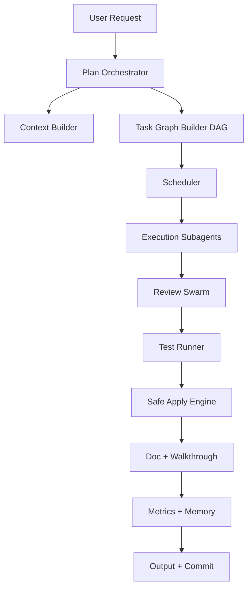

# SoloCode Pipeline v2

Data: 2026-03-05  
Stato: Proposta operativa approvata per implementazione incrementale  
Target: workflow stile Cursor, deterministico, affidabile, compatibile provider CLI + API

## 1) Obiettivo

Costruire una pipeline AI engineering dove:

- l'orchestrator decide sempre il flusso;
- gli agenti eseguono task assegnati;
- le modifiche sono patch-first;
- review e test sono gate obbligatori;
- il runtime è robusto con provider multipli;
- il comportamento è osservabile, ripetibile e ripristinabile.

## 2) Revisione critica del draft originario

Il draft iniziale è valido nella direzione, ma incompleto su alcuni punti critici.

Correzioni necessarie:

1. Il lock file non basta da solo: serve lock con lease, fairness, timeout e cleanup stale.
2. Il rollback deve essere transazionale su patch-set, non un concetto generico.
3. "Gli agenti non modificano il repo" va reso tecnico con una modalità `strict`.
4. Mancava un router capability-based per provider CLI/API.
5. Mancava una persistenza job-state robusta (event log + resume).
6. Test/documentazione devono essere gate risk-based, non solo slogan.
7. Auto-improvement loop va isolato su branch dedicato, mai auto-merge su trunk.

## 3) Stato attuale del codice (baseline reale)

Capacità già presenti e riusabili:

- Lock coordinator con fairness/lease/backoff: `CodeReview/Locking/FileLockCoordinator.swift`.
- Loop review multi-round (`fix -> test -> re-review`): `CodeReviewMultiSwarmProvider+Pipeline+Loop.swift`.
- Gate obbligatorio reviewer + testWriter dopo mutazioni: `ToolEnabledLLMProvider+Send.swift`.
- Tool MCP code review completi: `CoderIDETools+CodeReview.swift`.
- Tool MCP subagent completi: `CoderIDETools+Subagent.swift`.
- Plan/Todo/Panel tools già integrati: `CoderIDETools+PlanIntegration.swift`, `CoderIDETools+IdeIntegration.swift`.
- Provider factory multi-backend CLI/API già strutturata.

Gap principali:

- write-subagent CLI oggi è effettivamente codex-first (Claude read-only);
- manca un "apply engine" unico con patch manifest e rollback transazionale;
- policy `<300` righe non ancora enforced in CI.

## 4) Principi architetturali v2

1. Orchestrator authority: solo l'orchestrator chiude task e applica patch.
2. Determinismo: state machine, input/output formalizzati, retry bounded.
3. Patch-first: niente rewrite completo se non dichiarato e giustificato.
4. Safety-first: lock, policy ack, review/test mandatory, rollback sicuro.
5. Observability-first: ogni fase emette eventi strutturati.
6. Provider-agnostic: routing per capability, non per brand.
7. Moduli piccoli: target `<300` LOC/file, hard limit CI.

## 5) Architettura target

Componenti:

- `Orchestrator Core`
- `Context Builder`
- `DAG Scheduler`
- `Execution Layer (Subagent)`
- `Review & Validation`
- `Safe Apply Engine`
- `Observability + Project Memory`

## 6) Contratti MCP obbligatori per pipeline

### 6.1 Plan & state

- `coderide_plan_create`
- `coderide_plan_read`
- `coderide_plan_step_upsert`
- `coderide_plan_step_batch_update`
- `coderide_plan_step_reorder`
- `coderide_plan_step_dependency_set`
- `coderide_plan_set_walkthrough`
- `coderide_plan_history_read`
- `coderide_plan_diff`
- `coderide_plan_request_user_input`
- `coderide_plan_step_update`

### 6.2 Task tracking & panels

- `coderide_todo_write`
- `coderide_todo_read`
- `coderide_show_task_panel`
- `coderide_show_swarm_panel`
- `coderide_activate_plan_mode`
- `coderide_activate_debug_mode`

### 6.3 Subagent runtime

- `coderide_subagent_explorer`
- `coderide_subagent_coder`
- `coderide_subagent_debugger`
- `coderide_subagent_reviewer`
- `coderide_subagent_testWriter`
- `coderide_subagent_docWriter`
- `coderide_subagent_securityAuditor`

### 6.4 Code review runtime

- `coderide_review_start`
- `coderide_review_status`
- `coderide_review_findings`
- `coderide_review_apply_fix`
- `coderide_review_dismiss`
- `coderide_review_configure`
- `coderide_review_diff_summary`
- `coderide_review_comment`

### 6.5 Guardrail di policy/debug

- `coderide_policy_ack`
- `coderide_debug_set_phase`
- `coderide_debug_request_user`
- `coderide_debug_resolve`

## 7) Flusso esecutivo standard (Cursor-style)

### Fase 0: Intake + Plan

1. Attiva Plan Mode.
2. Crea piano con step DAG e dipendenze esplicite.
3. Registra todo iniziali con stato `pending`.

### Fase 1: Context build

1. Costruisci contesto minimo (semantic search, symbol search, refs, file outline).
2. Limita scope dei file per task.
3. Stima complessità e rischio.

### Fase 2: Execution (subagent)

1. Lancia explorer in parallelo su aree diverse.
2. Lancia coder/debugger su file-set disgiunti.
3. Ogni worker produce patch proposal + metadata.

### Fase 3: Review gate

1. Avvia `coderide_review_start`.
2. Raccogli findings e diff summary.
3. Se critico, nuova iterazione fix.
4. Reviewer + testWriter obbligatori dopo mutazioni.

### Fase 4: Validation gate

1. Lint.
2. Build.
3. Tests.
4. Security scan.
5. Se progetto iOS richiede run/test, usare sempre `xcodebuildmcp`.

### Fase 5: Safe apply + finalize

1. Validazione patch manifest.
2. Apply atomico.
3. Se failure, rollback patch-set.
4. Walkthrough finale nel Plan Panel.
5. Commit selettivo per file verificati.

## 8) Modalità operative

### Strict mode (default consigliata)

- I subagent non applicano direttamente.
- Producono solo patch proposal.
- Apply finale solo orchestrator.

### Fast mode (controllata)

- I subagent possono mutare file in sandbox.
- Review/test gate resta obbligatorio.
- Orchestrator valida e consolida prima del commit.

## 9) Strategia provider CLI + API

Routing capability-based:

1. Read-only analysis: qualsiasi backend con tooling read affidabile.
2. Workspace-write: backend con sandbox write verificata.
3. Review finale: provider diverso da quello che ha implementato.
4. Fallback: API patch-proposal-only quando CLI write non idoneo.
5. Timeouts: hard limit per ruolo (read-only più corto, write più lungo).

Regole pratiche:

- no hard-coding "un solo provider per tutto";
- preferire pluralità backend nei batch review;
- preservare tracciabilità per provider usato in ogni step.

## 10) Locking, patching, rollback

Lock policy:

- lock su set file + fairness FIFO su overlap;
- lease expiration per lock stale;
- cleanup automatico su timeout/cancel.

Patch policy:

- unified diff obbligatorio;
- patch metadata: `patch_id`, `task_id`, `provider`, `files`, `risk`, `timestamp`.

Rollback policy:

- rollback a livello patch-set;
- mai rollback globale distruttivo;
- evento audit sempre scritto.

## 11) CI Gate obbligatori

Pull request non mergiabile se fallisce uno di questi:

1. Build verde.
2. Test verdi.
3. Lint verde.
4. Review gate completato.
5. Nessun file oltre hard limit LOC.
6. Documentazione aggiornata se comportamento cambia.

Policy LOC:

- target: `<300` LOC per file;
- hard limit: `>500` blocca merge;
- warning: `301-500` richiede piano di split.

## 12) Observability e SLO

Metriche minime:

- tempo per fase e per task;
- lock contention rate;
- retry count per fase;
- patch reject rate;
- test failure rate post-fix;
- token/latency per provider.

SLO iniziali:

- completion pipeline p95 < 15m per task medio;
- rollback correctness 100%;
- orphan locks 0;
- mandatory review coverage 100% su task mutanti.

## 13) Project memory

`project_memory.json` versionato per workspace, con:

- standard di codifica;
- naming rules;
- pattern consentiti/vietati;
- decisioni ADR operative;
- baseline SLO e eccezioni approvate.

Regola:

- ogni run deve leggere memory all'inizio;
- ogni decisione strutturale la aggiorna a fine run.

## 14) Migliorie derivate da oh-my-codex (adattate)

Adottare:

1. Workflow conductor/worker esplicito.
2. Modalità operative separate (`plan`, `execute`, `review`, `verify`).
3. Health checks iniziali tipo `doctor`.
4. Prompt/role pack riusabili per compiti ricorrenti.
5. Stato persistente di run e resume dopo interruzioni.

Non adottare in produzione:

- bypass indiscriminato sandbox/approval;
- modalità ad alta aggressività senza gate di sicurezza.

## 15) Roadmap implementativa

### Milestone M0 (1-2 giorni)

- Scrivere schema `pipeline_job.json`.
- Definire patch manifest.
- Definire provider capability matrix.

### Milestone M1 (3-5 giorni)

- Implementare apply engine atomico.
- Collegare rollback transazionale.
- Collegare metriche minime e audit log.

### Milestone M2 (3-5 giorni)

- Enforcement LOC policy in CI.
- Enforcement strict/fast mode in orchestrator.
- Hardening retry/timeout policy.

### Milestone M3 (3-5 giorni)

- Router CLI/API capability-based completo.
- Fallback API patch-proposal-only.
- Cross-provider review obbligatoria.

### Milestone M4 (continuo)

- Auto-improvement loop su branch isolato.
- Benchmark periodici e tuning SLO.

## 16) Definition of Done della pipeline

La pipeline è "super solida" quando:

1. ogni task segue il DAG con stato persistito e resumable;
2. nessuna mutazione passa senza reviewer + testWriter;
3. apply/rollback sono atomici e auditabili;
4. provider fallback non rompe determinismo;
5. CI blocca regressioni strutturali e violazioni LOC;
6. output finale include sempre summary tecnico + stato gate.
