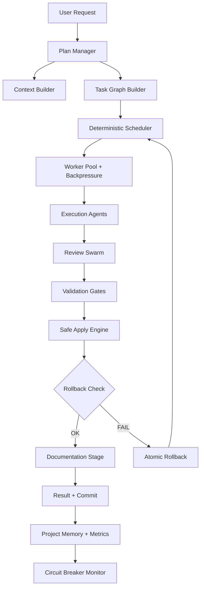
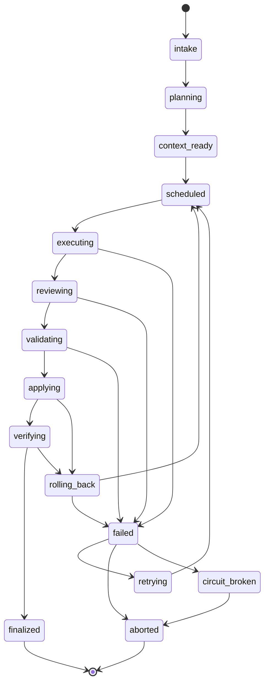
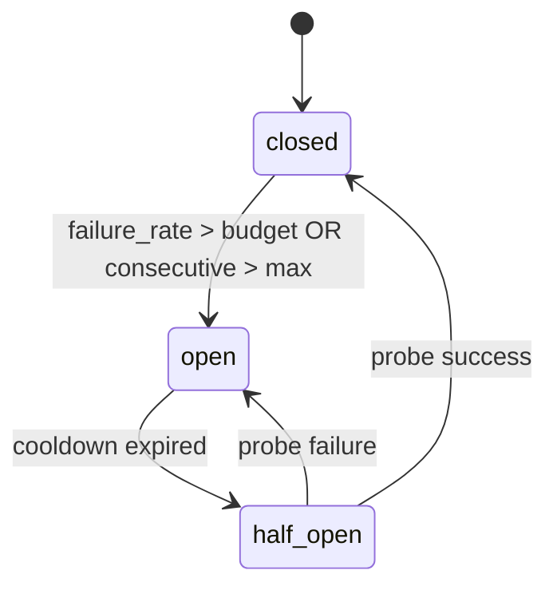

# SoloCode Pipeline v2.2

Data: 2026-03-05
Stato: Specifica operativa completa
Obiettivo: pipeline AI engineering stile Cursor, deterministica, robusta, provider-agnostic (CLI + API), con orchestrator centrale

## 0. Convenzioni normative

In questo documento:

- `MUST`: obbligatorio
- `SHOULD`: fortemente raccomandato
- `MAY`: opzionale

Le regole `MUST` sono vincoli di sistema e di CI.

## 1. Scope

Questa specifica copre:

1. architettura end-to-end della pipeline;
2. processi di esecuzione fase per fase;
3. catalogo completo tool MCP usati nel flusso;
4. contratti dati (job/task/patch/review/memory);
5. algoritmi di orchestrazione (DAG, scheduler, lock, apply);
6. strategia provider CLI + API;
7. quality gates (review/test/docs/security/size);
8. piano implementativo concreto con struttura file;
9. concurrency model e backpressure;
10. circuit breaker e error budget;
11. rollback strategy concreta;
12. delivery guarantees event bus;
13. context compression e token budget;
14. swarm budget e limiti agenti.

Non copre:

1. UI pixel-level design;
2. dettagli cloud multi-tenant;
3. billing/accounting avanzato provider.

## 2. Principi invarianti

1. `Orchestrator authority`: solo l'orchestrator decide ordine, retry, apply e chiusura task.
2. `Task determinism`: task con input/output tipizzati, idempotenti quando possibile.
3. `Patch-first`: niente rewrite completo salvo casi espliciti e tracciati.
4. `Safe concurrency`: lock file-set + fairness + lease + timeout + symbol scope.
5. `Mandatory quality`: ogni mutazione deve passare review + test.
6. `Auditability`: ogni decisione e ogni patch sono tracciate.
7. `Provider neutrality`: routing per capability, non per nome provider.
8. `Small modules`: target `<300` LOC/file, hard block `>500` (con escape hatch documentato).
9. `Fail-fast resilience`: circuit breaker globale e error budget per job.
10. `Atomic rollback`: ogni apply ha rollback garantito e verificabile.

## 3. Baseline reale del repository

Capacità già presenti:

1. `FileLockCoordinator` con lease/fairness/backoff.
2. `CodeReviewMultiSwarmProvider` con fix/test/re-review loop.
3. `ToolEnabledLLMProvider` con gate obbligatorio reviewer + testWriter post-mutation.
4. catalogo MCP esteso (plan/subagent/review/debug/todo/search/file ops).
5. provider factory multi-backend CLI/API.

Gap tecnici principali:

1. write-subagent CLI oggi è codex-first (Claude read-only, Gemini non idoneo write-safe nel path subagent).
2. manca un apply engine transazionale unico con patch manifest formale.
3. manca enforcement CI hard del limite `<300` e blocco `>500`.
4. manca schema persistente standard per job DAG + resume automatico.
5. manca concurrency model esplicito per scheduler DAG.
6. manca circuit breaker / error budget globale.
7. manca rollback strategy concreta (branch temporaneo, snapshot, etc.).
8. manca delivery guarantee per event bus.

## 4. Architettura target



Componenti logici:

1. `Plan Manager`
2. `Context Builder`
3. `Context Ranking Engine`
4. `Task Graph Builder`
5. `Scheduler`
6. `Worker Pool` (con concurrency limit e backpressure)
7. `Event Bus Interno` (con delivery guarantees)
8. `Execution Layer`
9. `Review Layer`
10. `Validation Layer`
11. `Apply Engine`
12. `Rollback Service`
13. `Circuit Breaker`
14. `Memory & Observability`

## 5. Orchestrator Core — Design e Implementazione

Questa sezione definisce il cuore operativo della pipeline SoloCode. L'Orchestrator è il **single source of truth** dell'intera pipeline.

### 5.0 Autorità esclusiva

Nessun agente può modificare direttamente:

1. il repository (file, branch, commit);
2. lo stato della pipeline (job state, task state);
3. lo scheduling dei task (ordine, priorità, dispatch).

Gli agenti eseguono **solo** task assegnati dall'Orchestrator e restituiscono risultati tramite `agent_action_envelope`. Qualsiasi azione fuori scope MUST essere rifiutata.

### 5.1 Responsabilità

L'Orchestrator MUST gestire:

1. **State machine** — ciclo di vita del job e dei task;
2. **Scheduling DAG** — ordinamento, priorità, starvation prevention;
3. **Lock management** — acquisizione/rilascio lock su file e simboli;
4. **Worker pool** — dispatch agenti con concurrency limit e backpressure;
5. **Retry policy** — exponential backoff con jitter, budget tentativi;
6. **Circuit breaker** — protezione da cascading failures;
7. **Context management** — cache, compression, ranking adattivo;
8. **Provider routing** — selezione provider per capability, health check, fallback;
9. **Review orchestration** — lancio review swarm, convergence check, semantic diff;
10. **Validation gates** — lint, build, test, security;
11. **Apply transaction** — patch atomico con dry-run;
12. **Rollback** — ripristino garantito con verifica checksum;
13. **Event emission** — produzione eventi per event bus con at-least-once delivery;
14. **Documentation dispatch** — lancio docWriter quando richiesto (§6.14).

### 5.2 Architettura interna

```text
Orchestrator
│
├── StateMachine           // ciclo di vita job (§5.3)
├── DagScheduler           // ordinamento e dispatch task (§11)
├── WorkerPool             // concurrency limit + backpressure (§11.1)
├── LockManager            // file + symbol scope locks (§12)
├── EventBus               // at-least-once delivery + DLQ (§6.9)
├── ContextManager         // cache + compression + ranking (§8.3)
│   ├── ContextCache       // context_cache[task_signature]
│   ├── ContextCompressor  // semantic/AST/dependency pruning
│   └── ContextRanker      // pesi adattivi per task_type
├── PatchApplyEngine       // apply atomico + dry-run (§13)
├── RollbackService        // 3 strategie rollback (§13.1)
├── SemanticDiffEngine     // AST diff pre-review (§8.6)
├── CircuitBreaker         // error budget + half-open probe (§17)
├── ProviderRouter         // capability routing + health check (§14)
│   └── HealthChecker      // probe periodico + recovery
├── SwarmBudgetManager     // limiti agenti per ruolo/job (§8.5)
└── AgentNameAssigner      // naming convention {label}-{role} (§6.13)
```

Vincoli architetturali:

1. ogni componente MUST essere isolato e testabile indipendentemente;
2. comunicazione tra componenti solo via interfacce definite, MAI accoppiamento diretto;
3. ogni componente MUST esporre metriche proprie;
4. nessun componente può bypassare l'Orchestrator per accedere al repository.

### 5.3 State Machine

La state machine governa il ciclo di vita del job.



Stati principali:

| Stato | Descrizione | Transizioni valide |
|-------|-------------|-------------------|
| `intake` | Job ricevuto, preflight in corso | → `planning` |
| `planning` | Generazione piano DAG | → `context_ready` |
| `context_ready` | Contesto costruito per tutti i task | → `scheduled` |
| `scheduled` | Task pronti per dispatch | → `executing` |
| `executing` | Agenti in esecuzione | → `reviewing`, → `failed` |
| `reviewing` | Review swarm attiva | → `validating`, → `failed` |
| `validating` | Lint/build/test in corso | → `applying`, → `failed` |
| `applying` | Patch apply in corso | → `verifying`, → `rolling_back` |
| `verifying` | Verifica post-apply | → `finalized`, → `rolling_back` |
| `finalized` | Task completato con successo | terminale |

Stati di errore e recovery:

| Stato | Descrizione | Transizioni valide |
|-------|-------------|-------------------|
| `failed` | Task fallito | → `retrying`, → `aborted`, → `circuit_broken` |
| `rolling_back` | Rollback atomico in corso | → `scheduled` (retry), → `failed` |
| `retrying` | Preparazione retry | → `scheduled` |
| `circuit_broken` | Error budget esaurito | → `aborted` |
| `aborted` | Job terminato per errore | terminale |

Invarianti state machine:

1. l'Orchestrator è l'**unico** componente autorizzato a cambiare stato;
2. ogni transizione MUST essere registrata nell'event log;
3. transizioni non valide MUST essere rifiutate con errore;
4. stato `rolling_back` MUST completare entro `10000ms` o causare `failed`;
5. stato `circuit_broken` è raggiungibile solo da `failed`, MAI da stati di successo.

### 5.4 Main Loop dell'Orchestrator

```text
orchestrator_main_loop:
  while job.state not in [finalized, aborted]:

    # ── Guard globali ──────────────────────────────────────
    if elapsed_ms(job.created_at) > job.job_timeout_ms:
      emit_event("job_timeout")
      abort_job("timeout")
      break

    if circuit_breaker.state == "open":
      if circuit_breaker.cooldown_expired():
        circuit_breaker.transition("half_open")
        probe_task = scheduler.get_lowest_risk_ready_task()
        if probe_task:
          dispatch_single(probe_task, probe=true)
      else:
        wait(min(circuit_breaker.remaining_cooldown, 1000ms))
      continue

    # ── Scheduling ─────────────────────────────────────────
    ready_tasks = scheduler.get_ready_tasks()  # deps soddisfatte, sorted by effective_priority

    for task in ready_tasks:
      # Backpressure check
      if worker_pool.active >= worker_pool.max_workers:
        emit_event("scheduler_backpressure")
        break

      # Swarm budget check
      if not swarm_budget.has_capacity(task, task.next_agent_role):
        continue

      # Lock acquisition
      lock_scope = task.file_scope ∪ task.symbol_scope
      if not lock_manager.acquire(lock_scope, task.task_id):
        task.waiting_since = now()  # per starvation prevention
        continue

      # Context resolution
      context = context_manager.resolve(task)
      # → cache lookup → build → compress → cache store

      # Agent naming e dispatch
      agent_name = agent_name_assigner.assign(task)
      provider = provider_router.select(task, task.next_agent_role)

      worker_pool.dispatch_async(task, agent_name, provider, context)
      swarm_budget.reserve(task, task.next_agent_role)
      emit_event("task_started", {agent_name, provider})

    # ── Completion handling ────────────────────────────────
    completed = worker_pool.await_any(timeout=5000ms)

    for result in completed:
      worker_pool.release(result.worker_id)
      swarm_budget.release(result.task, result.agent_role)
      lock_manager.release(result.task.lock_scope)

      if result.success:
        handle_success(result)
      else:
        handle_failure(result)
```

### 5.5 Task Completion Handling

```text
handle_success(result):
  circuit_breaker.record_success()
  emit_event("task_completed", {result.task_id, result.agent_name})

  match result.agent_role:
    case "explorer":
      # contesto arricchito, ready per coder
      task.context_enriched = true
      schedule_next_agent(task, "coder")

    case "coder":
      # patch proposal prodotto
      validate_agent_action_envelope(result.envelope)
      register_patch_manifest(result.patch)
      # genera semantic diff prima della review
      semantic_diff = semantic_diff_engine.compute(result.patch)
      attach_semantic_diff(result.patch, semantic_diff)
      schedule_next_agent(task, "reviewer")

    case "debugger":
      validate_agent_action_envelope(result.envelope)
      register_patch_manifest(result.patch)
      semantic_diff = semantic_diff_engine.compute(result.patch)
      attach_semantic_diff(result.patch, semantic_diff)
      schedule_next_agent(task, "reviewer")

    case "reviewer":
      if result.findings.has_critical():
        schedule_fix_round(task, result.findings)
      else:
        schedule_next_agent(task, "testWriter")

    case "testWriter":
      if result.tests_pass:
        if should_invoke_doc_writer(task):  # §6.14 rules
          schedule_next_agent(task, "docWriter")
        else:
          transition_to_validation(task)
      else:
        schedule_fix_round(task, result.test_failures)

    case "docWriter":
      validate_agent_action_envelope(result.envelope)
      register_doc_patches(result.doc_actions)
      transition_to_validation(task)

    case "securityAuditor":
      if result.has_vulnerabilities():
        task.status = "blocked"
        emit_event("security_block", {result.findings})
      else:
        continue_pipeline(task)

handle_failure(result):
  circuit_breaker.record_failure()
  emit_event("task_failed", {result.task_id, result.error})

  if circuit_breaker.should_trip():
    circuit_breaker.transition("open")
    emit_event("circuit_breaker_triggered")
    return

  if result.task.attempts < result.task.max_attempts and retryable(result.error):
    result.task.attempts += 1
    delay = retry_policy.calculate_delay(result.task.attempts)
    schedule_retry(result.task, delay)
  else:
    result.task.status = "failed"
    if job.fail_policy == "fail_fast":
      abort_job("fail_fast")
```

### 5.6 Apply Transaction Flow

Solo l'Orchestrator può applicare patch. Nessun agente ha accesso diretto al repository.

```text
apply_transaction(task, patch_set):
  # 1. Validazione
  for patch in patch_set:
    validate_manifest_schema(patch.manifest)
    validate_risk_score(patch)        # §13.4
    if patch.risk_score > 0.7:
      require_extra_review(patch)

  # 2. Blast radius check
  total_files = count_unique_files(patch_set)
  if total_files > 25:
    require_manual_approval(patch_set)
    return "awaiting_approval"
  elif total_files > 12:
    require_extra_review(patch_set)

  # 3. Lock verification
  for patch in patch_set:
    if not lock_manager.verify_ownership(patch.touched_files, task.task_id):
      abort_apply("lock_violation", patch)
      return "failed"

  # 4. Rollback point
  rollback_ref = rollback_service.create_rollback_point(
    strategy=job.rollback_strategy,  # git_branch | git_stash | filesystem_snapshot
    patch_id=patch_set.id,
    files=patch_set.all_touched_files
  )

  # 5. Dry run
  dry_run_result = patch_engine.dry_run(patch_set)
  if not dry_run_result.success:
    rollback_service.cleanup(rollback_ref)
    return "patch_conflict"

  # 6. Apply
  apply_result = patch_engine.apply(patch_set)
  if not apply_result.success:
    rollback_service.execute(rollback_ref)
    emit_event("patch_apply_failed")
    return "failed"

  # 7. Verify
  verify_result = run_quick_verify(patch_set.touched_files, timeout=30000ms)
  if not verify_result.success:
    rollback_service.execute(rollback_ref)
    emit_event("verify_failed_rollback")
    task.attempts += 1
    reschedule(task)
    return "rolled_back"

  # 8. Cleanup
  rollback_service.cleanup(rollback_ref)
  emit_event("patch_applied", {patch_set.id, total_files})
  return "success"
```

### 5.7 Rollback Flow

Rollback MUST essere atomico e verificabile.

```text
rollback_execute(rollback_ref):
  emit_event("rollback_started", {rollback_ref})
  start_time = now()

  match rollback_ref.strategy:
    case "git_branch":
      for file in rollback_ref.files:
        restore_from_branch(rollback_ref.branch, file)
      delete_branch(rollback_ref.branch)

    case "git_stash":
      git_stash_pop(rollback_ref.stash_id)

    case "filesystem_snapshot":
      for file in rollback_ref.files:
        copy_from_snapshot(rollback_ref.snapshot_dir, file)
      delete_snapshot_dir(rollback_ref.snapshot_dir)

  # Verifica integrità
  for file in rollback_ref.files:
    actual_checksum = compute_checksum(file)
    if actual_checksum != rollback_ref.checksums[file]:
      emit_event("rollback_checksum_mismatch", {file})
      abort_job("rollback_integrity_failure")
      return "failed"

  elapsed = now() - start_time
  if elapsed > 10000ms:
    emit_event("rollback_slow", {elapsed})

  # Record
  record = RollbackRecord(
    rollback_id=generate_id(),
    job_id=job.id,
    task_id=task.id,
    patch_id=rollback_ref.patch_id,
    strategy=rollback_ref.strategy,
    files_restored=rollback_ref.files,
    started_at=start_time,
    completed_at=now(),
    status="success",
    verification_passed=true
  )
  persist(record)
  emit_event("rollback_completed", {record.rollback_id})
  return "success"
```

Se rollback fallisce:

```text
rollback_failure_handler():
  emit_event("rollback_failed", {error_detail})
  # NON tentare auto-recovery — stato potenzialmente corrotto
  # Mantieni branch/stash/snapshot per recovery manuale
  abort_job("rollback_failure")
  notify_operator({
    job_id,
    failed_files,
    rollback_ref,
    instructions: "Manual recovery required. Rollback artifacts preserved."
  })
```

### 5.8 Context Management

Prima di ogni dispatch, l'Orchestrator risolve il contesto per il task.

```text
context_manager.resolve(task):
  # 1. Cache lookup
  task_signature = hash(task.file_scope + task.symbol_scope + task.task_type + repo.HEAD)
  cached = context_cache.get(task_signature)
  if cached and not cached.expired(TTL=300000ms):
    emit_metric("context_cache_hit")
    return cached.bundle

  emit_metric("context_cache_miss")

  # 2. Context build (§8.3)
  weights = context_weight_profile.get(task.task_type)
  raw_context = context_builder.build(
    file_scope=task.file_scope,
    symbol_scope=task.symbol_scope,
    weights=weights  # adattivi per task_type
  )

  # 3. Context compression (se necessario)
  token_count = count_tokens(raw_context)
  if token_count > HARD_LIMIT (64000):
    raw_context = compressor.apply_dependency_pruning(raw_context)
    raw_context = compressor.apply_ast_compression(raw_context)
    if count_tokens(raw_context) > HARD_LIMIT:
      raw_context = compressor.apply_semantic_summarization(raw_context)
  elif token_count > SOFT_LIMIT (32000):
    raw_context = compressor.apply_ast_compression(raw_context, exclude=task.file_scope)

  emit_metric("context_compression_ratio", original=token_count, final=count_tokens(raw_context))

  # 4. Cache store
  context_cache.put(task_signature, raw_context)
  return raw_context
```

### 5.9 Provider Routing

Il provider viene selezionato per capability, non per nome.

```text
provider_router.select(task, agent_role):
  # 1. Filtra per capability richiesta
  required_caps = get_required_capabilities(agent_role)
  # es: coder richiede supports_write_subagent + supports_workspace_sandbox

  candidates = providers.filter(
    p -> p.supports(required_caps)
    and p.health_status != "unhealthy"
  )

  if candidates.empty():
    # Fallback: prova con capability ridotte (proposal-only)
    candidates = providers.filter(p -> p.health_status != "unhealthy")
    if candidates.empty():
      emit_event("no_provider_available")
      return error("all_providers_unhealthy")

  # 2. Ranking per preferenza
  ranked = candidates.sort_by(
    p -> (
      capability_match_score(p, required_caps) * 0.4
      + (1.0 - p.error_rate_last_hour) * 0.3
      + (1.0 - normalize(p.avg_latency_ms)) * 0.2
      + cost_efficiency_score(p) * 0.1
    )
  )

  selected = ranked.first()

  # 3. Log decisione (per determinismo replay)
  emit_event("provider_selected", {
    task_id: task.id,
    agent_role: agent_role,
    provider: selected.id,
    reason: "capability_match",
    candidates_count: candidates.size()
  })

  return selected
```

### 5.10 Circuit Breaker Integration

Il circuit breaker è consultato ad ogni iterazione del main loop.

```text
circuit_breaker_check():
  match circuit_breaker.state:
    case "closed":
      # Pipeline opera normalmente
      # Check continuo: dovremmo aprire?
      if should_trip():
        transition("open")
        emit_event("circuit_breaker_triggered", {
          failure_rate: current_failure_rate(),
          consecutive: consecutive_failures,
          error_budget_remaining: error_budget.remaining()
        })

    case "open":
      # Nessun task dispatched
      if cooldown_expired():
        transition("half_open")

    case "half_open":
      # Un solo probe task in volo
      # Risultato gestito da handle_success/handle_failure
      pass

should_trip():
  # Job con < 5 task: circuit breaker disabilitato
  if total_tasks < 5:
    return false

  return (
    failure_rate_percent > job.error_budget.max_failed_tasks_percent
    or consecutive_failures >= job.error_budget.max_consecutive_failures
  )
```

### 5.11 Determinismo e riproducibilità

Per garantire che il replay (§6.10) riproduca identicamente le decisioni dell'Orchestrator:

1. **Scheduling deterministico**: dato lo stesso set di task ready, l'ordine di dispatch è sempre identico (`effective_priority desc, created_at asc`);
2. **Sequence number**: ogni evento ha `sequence_number` monotonicamente crescente, che stabilisce ordine totale;
3. **Provider decision logging**: ogni scelta di provider è loggata con reason e alternative considerate;
4. **Lock ordering**: acquisizione lock in ordine lessicografico per prevenire deadlock;
5. **Retry timing**: `delay = min(base * 2^attempt + deterministic_jitter(seed, attempt), max_delay)` — jitter calcolato da seed, non random.

Cosa è riproducibile:

1. ordine di scheduling;
2. decisioni di routing provider;
3. retry/fallback decisions;
4. apply/rollback decisions;
5. circuit breaker transitions.

Cosa NON è riproducibile:

1. output degli agenti LLM (stocastici);
2. timing esatto dei completamenti;
3. contenuto delle patch proposte.

### 5.12 Invarianti fondamentali

Queste invarianti MUST essere vere in **ogni** momento durante l'esecuzione della pipeline:

1. **Solo orchestrator applica patch** — nessun agente scrive direttamente sul repository;
2. **Ogni mutazione passa review + test** — MAI applicare una patch senza reviewer e testWriter completati;
3. **Ogni patch ha rollback point** — rollback point creato PRIMA dell'apply, MAI dopo;
4. **Ogni evento è tracciato** — nessuna decisione dell'orchestrator avviene senza evento corrispondente;
5. **Ogni task è deterministico nel flusso** — dato lo stesso input, le decisioni dell'orchestrator sono identiche;
6. **Lock prima di write** — nessuna modifica a file senza lock attivo e verificato;
7. **Agent isolation** — agenti in sandbox, zero accesso diretto al repo;
8. **Budget rispettato** — concurrency limit, swarm budget e error budget MAI superati;
9. **Naming consistente** — ogni agente ha `agent_name` assegnato dall'orchestrator, presente in tutti gli artefatti;
10. **Timeout globale** — nessun job gira indefinitamente.

### 5.13 Performance Targets

SLO operativi dell'Orchestrator:

| Operazione | Target | Hard Limit |
|-----------|--------|-----------|
| Scheduler tick (1 iterazione loop) | < 5ms | < 20ms |
| Context cache lookup | < 10ms | < 50ms |
| Context build (cache miss) | < 2000ms | < 5000ms |
| Lock acquire/release | < 5ms | < 20ms |
| Agent dispatch latency | < 50ms | < 100ms |
| Rollback execution | < 5000ms | < 10000ms |
| Semantic diff generation | < 1000ms | < 3000ms |
| Event emission | < 2ms | < 10ms |

Vincoli:

1. scheduler tick > 20ms MUST emettere warning `scheduler_slow`;
2. context build > 5000ms MUST emettere warning e considerare riduzione scope;
3. rollback > 10000ms MUST causare abort job.

### 5.14 Estensioni future

Possibili evoluzioni architetturali (non in scope v2.2):

1. **Distributed orchestrator** — multi-nodo con leader election per alta disponibilità;
2. **Multi-node worker pools** — worker distribuiti su macchine diverse;
3. **Cross-repo pipelines** — task che toccano più repository con coordinamento transazionale;
4. **Remote execution clusters** — dispatch agenti su cluster cloud;
5. **Adaptive scheduling** — machine learning su storico per ottimizzare priorità e provider selection;
6. **Streaming event bus** — migrazione da at-least-once locale a streaming distribuito (Kafka, NATS).

Queste estensioni richiedono ADR dedicato e NON devono influenzare il design attuale.

---

*Questa sezione (§5) definisce il comportamento minimo richiesto per un Orchestrator conforme alla SoloCode Pipeline v2.2. Ogni implementazione MUST soddisfare tutte le invarianti (§5.12) e rispettare i performance targets (§5.13).*

## 6. Contratti dati obbligatori

## 6.1 `pipeline_job.json`

```json
{
  "job_id": "job_20260305_001",
  "workspace": "/abs/path/repo",
  "request": "testo richiesta utente",
  "mode": "strict",
  "created_at": "2026-03-05T15:00:00Z",
  "state": "planning",
  "policy_version": "v2.2",
  "selected_provider_profile": "default",
  "plan_snapshot_id": "plan_123",
  "job_timeout_ms": 1800000,
  "max_concurrent_workers": 4,
  "error_budget": {
    "max_failed_tasks_percent": 30,
    "max_consecutive_failures": 5
  },
  "rollback_strategy": "git_branch"
}
```

Campi minimi:

1. `job_id`
2. `workspace`
3. `request`
4. `mode`
5. `state`
6. `job_timeout_ms`
7. `error_budget`

Vincoli nuovi:

1. `job_timeout_ms` MUST essere presente; default `1800000` (30 min).
2. `max_concurrent_workers` MUST essere `1..8`; default `4`.
3. `error_budget.max_failed_tasks_percent` MUST essere `1..100`; default `30`.
4. `error_budget.max_consecutive_failures` MUST essere `1..20`; default `5`.
5. `rollback_strategy` MUST essere enum: `git_branch | git_stash | filesystem_snapshot`.

## 6.2 `task_node.json`

```json
{
  "task_id": "T3",
  "title": "Refactor parser lock handling",
  "depends_on": ["T1", "T2"],
  "priority": 70,
  "risk": "medium",
  "task_type": "feature",
  "file_scope": ["Sources/A.swift", "Sources/B.swift"],
  "symbol_scope": ["ParserLock", "LockManager"],
  "status": "pending",
  "attempts": 0,
  "max_attempts": 3,
  "timeout_ms": 120000
}
```

Campi nuovi:

1. `task_type` MUST essere enum: `feature | bugfix | refactor | test | docs`. Influenza i pesi del context ranking.
2. `symbol_scope` SHOULD essere popolato per lock conflitto simbolico.
3. `timeout_ms` MUST avere default `120000` (2 min).

## 6.3 `patch_manifest.json`

```json
{
  "patch_id": "p_abc123",
  "job_id": "job_20260305_001",
  "task_id": "T3",
  "provider": "codex-cli",
  "agent_role": "coder",
  "touched_files": ["Sources/A.swift"],
  "unified_diff_path": "artifacts/patches/p_abc123.diff",
  "risk_score": 0.42,
  "risk_breakdown": {
    "files_changed_score": 0.1,
    "lines_changed_score": 0.15,
    "core_module_score": 0.05,
    "test_vs_production_ratio": 0.8,
    "dependents_count": 3,
    "file_bug_history_score": 0.12
  },
  "created_at": "2026-03-05T15:07:30Z",
  "status": "proposed",
  "rollback_ref": "branch:patch_rollback_p_abc123"
}
```

Campi nuovi:

1. `risk_breakdown` SHOULD essere incluso per trasparenza del risk scoring.
2. `rollback_ref` MUST essere popolato dopo apply riuscito.

## 6.4 `review_session.json`

```json
{
  "session_id": "rev_987",
  "scope": "uncommitted",
  "max_workers": 6,
  "max_rounds": 3,
  "analysis_backend": "codex",
  "execution_backend": "codex",
  "phase": "reviewing",
  "findings_count": 4
}
```

## 6.5 `provider_capability_matrix.json`

```json
{
  "providers": [
    {
      "id": "codex-cli",
      "supports_readonly_subagent": true,
      "supports_write_subagent": true,
      "supports_workspace_sandbox": true,
      "supports_native_tools": true,
      "health_status": "healthy",
      "last_health_check": "2026-03-05T15:00:00Z",
      "health_check_interval_ms": 60000,
      "error_rate_last_hour": 0.02
    },
    {
      "id": "claude-cli",
      "supports_readonly_subagent": true,
      "supports_write_subagent": false,
      "supports_workspace_sandbox": false,
      "supports_native_tools": true,
      "health_status": "healthy",
      "last_health_check": "2026-03-05T15:00:00Z",
      "health_check_interval_ms": 60000,
      "error_rate_last_hour": 0.0
    }
  ],
  "health_check_config": {
    "probe_timeout_ms": 5000,
    "unhealthy_threshold": 3,
    "healthy_threshold": 1,
    "auto_fallback_on_unhealthy": true
  }
}
```

Vincoli nuovi (health check runtime):

1. `health_status` MUST essere aggiornato ogni `health_check_interval_ms`.
2. dopo `unhealthy_threshold` fallimenti consecutivi, provider MUST essere marcato `unhealthy`.
3. provider `unhealthy` MUST essere escluso dal routing fino a recovery.
4. `error_rate_last_hour` MUST essere calcolato su finestra sliding di 60 min.
5. capability probing SHOULD essere eseguito al boot e dopo recovery.

## 6.6 `project_memory.json`

```json
{
  "workspace": "/abs/path/repo",
  "coding_standards": ["swiftlint strict", "no giant files"],
  "naming_rules": ["camelCase functions", "PascalCase types"],
  "forbidden_patterns": ["force unwrap in production paths"],
  "architecture_notes": ["adapter layer mandatory for external APIs"],
  "file_bug_history": {
    "Sources/AuthManager.swift": {"bug_count": 5, "last_bug": "2026-02-20"},
    "Sources/Parser.swift": {"bug_count": 2, "last_bug": "2026-01-15"}
  },
  "last_updated_at": "2026-03-05T15:00:00Z"
}
```

Campi nuovi:

1. `file_bug_history` SHOULD essere mantenuto per arricchire il risk scoring.

## 6.7 `event_log.ndjson`

Ogni evento MUST essere append-only:

```json
{"ts":"2026-03-05T15:00:05Z","job_id":"job_1","task_id":"T1","agent_id":"agent_01","agent_name":"RefactorParserLock-explorer","correlation_id":"corr_1","phase":"planning","event":"plan_created","sequence_number":1}
{"ts":"2026-03-05T15:01:10Z","job_id":"job_1","task_id":"T2","agent_id":"agent_02","agent_name":"FixAuthToken-coder","correlation_id":"corr_2","phase":"executing","event":"subagent_started","role":"coder","sequence_number":2}
```

Vincoli aggiuntivi evento:

1. ogni evento MUST includere `job_id`, `task_id`, `agent_id`, `correlation_id` quando applicabile;
2. `correlation_id` MUST restare stabile lungo tutta la catena causale dello stesso step;
3. eventi senza correlation metadata sono invalidi in produzione;
4. `sequence_number` MUST essere monotonicamente crescente per job, per garantire ordinamento deterministico nel replay.

## 6.8 `agent_action_envelope.json`

Tutti gli agenti MUST restituire output JSON tipizzato.

Schema base:

```json
{
  "agent_id": "agent_coder_01",
  "agent_name": "RefactorParserLock-coder",
  "agent_role": "coder",
  "job_id": "job_123",
  "task_id": "T3",
  "correlation_id": "corr_abc",
  "actions": [
    {
      "type": "patch_proposal",
      "file": "Sources/AuthManager.swift",
      "diff": "unified diff"
    }
  ],
  "confidence": 0.82,
  "notes": "refactor parser locking"
}
```

Campi obbligatori:

1. `agent_id`
2. `agent_name`
3. `agent_role`
4. `job_id`
5. `task_id`
6. `actions`

Vincoli:

1. `actions[].type` MUST essere enum noto (`patch_proposal`, `analysis_note`, `test_update`, `doc_update`, `doc_changelog`, `doc_flow_update`);
2. output free-text non tipizzato MUST essere rifiutato dal parser orchestrator;
3. `confidence` fuori range `0..1` MUST invalidare il payload;
4. `agent_name` MUST seguire la convenzione di naming (vedi §6.13).

## 6.9 `event_bus_event.json`

Gli agenti NON comunicano direttamente tra loro.
Le comunicazioni passano da event bus orchestrato.

Schema evento:

```json
{
  "event_id": "evt_123",
  "job_id": "job_123",
  "task_id": "T3",
  "agent_id": "agent_coder_01",
  "correlation_id": "corr_abc",
  "type": "patch_created",
  "payload": {},
  "timestamp": "2026-03-05T15:00:00Z",
  "sequence_number": 42,
  "idempotency_key": "evt_123_patch_created_T3",
  "delivery_status": "pending"
}
```

Tipi evento minimi:

1. `task_started`
2. `task_completed`
3. `task_failed`
4. `patch_created`
5. `review_failed`
6. `review_passed`
7. `lock_acquired`
8. `lock_released`
9. `rollback_started`
10. `rollback_completed`
11. `circuit_breaker_triggered`
12. `provider_health_changed`

Delivery guarantees (MUST):

1. event bus MUST implementare at-least-once delivery;
2. ogni evento MUST avere `idempotency_key` unico;
3. consumer MUST implementare idempotency check basato su `idempotency_key`;
4. eventi non consegnati dopo 3 tentativi MUST essere inviati a dead letter queue;
5. dead letter queue MUST essere monitorata e alertata.

## 6.10 `replay_snapshot.json`

La pipeline MUST essere riproducibile **a livello di decisioni orchestrator**.

```json
{
  "job_snapshot_path": "artifacts/jobs/job_123.json",
  "event_log_path": "artifacts/events/job_123.ndjson",
  "provider_selection": [
    {"phase":"planning","provider":"codex-cli"},
    {"phase":"review","provider":"openai-api"}
  ],
  "seed": "deterministic-seed-1",
  "replay_scope": "orchestrator_decisions"
}
```

Input replay minimi:

1. job snapshot;
2. event log;
3. provider selection.

Output replay atteso:

1. riproduzione identica delle **decisioni orchestrator** (scheduling, lock, routing, retry, apply/rollback);
2. output agenti LLM sono stocastici e NON possono essere riprodotti identicamente;
3. divergenze tra decisioni orchestrator MUST essere annotate con report diff;
4. `replay_scope` MUST essere `orchestrator_decisions` (non `full`, che è impossibile con LLM stocastici).

## 6.11 `circuit_breaker_state.json` (NUOVO)

```json
{
  "job_id": "job_123",
  "state": "closed",
  "consecutive_failures": 0,
  "total_failures": 2,
  "total_tasks": 15,
  "failure_rate_percent": 13.3,
  "last_failure_at": "2026-03-05T15:05:00Z",
  "tripped_at": null,
  "cooldown_ms": 30000
}
```

Vincoli:

1. `state` MUST essere enum: `closed | open | half_open`.
2. `closed`: pipeline opera normalmente.
3. `open`: pipeline fermata, nessun nuovo task dispatched.
4. `half_open`: un solo task di prova viene dispatched; se riesce torna `closed`, se fallisce torna `open`.
5. transition `closed -> open` MUST avvenire quando `failure_rate_percent > error_budget.max_failed_tasks_percent` OPPURE `consecutive_failures >= error_budget.max_consecutive_failures`.

## 6.12 `rollback_record.json` (NUOVO)

```json
{
  "rollback_id": "rb_456",
  "job_id": "job_123",
  "task_id": "T3",
  "patch_id": "p_abc123",
  "strategy": "git_branch",
  "rollback_ref": "branch:patch_rollback_p_abc123",
  "files_restored": ["Sources/A.swift", "Sources/B.swift"],
  "started_at": "2026-03-05T15:10:00Z",
  "completed_at": "2026-03-05T15:10:02Z",
  "status": "success",
  "verification_passed": true
}
```

## 6.13 Agent Naming Convention (NUOVO)

Ogni agente lanciato nella pipeline MUST avere un nome univoco e leggibile composto da:

```text
{task_label}-{agent_role}
```

Dove:

1. `task_label` = nome breve derivato dal titolo del task (slug, camelCase o PascalCase);
2. `agent_role` = ruolo dell'agente nel swarm.

Ruoli validi:

| Ruolo | Descrizione | Read/Write |
|-------|-------------|------------|
| `explorer` | Analisi codebase, ricerca contesto, navigazione simboli | Read-only |
| `coder` | Scrittura codice, patch proposal | Write |
| `debugger` | Diagnosi bug, fix mirato | Write |
| `reviewer` | Code review, findings, quality check | Read-only |
| `testWriter` | Scrittura e aggiornamento test | Write |
| `docWriter` | Documentazione ufficiale, changelog, flow docs | Write |
| `securityAuditor` | Audit sicurezza, vulnerability check | Read-only |

Esempi di naming:

```text
Task: "Refactor parser lock handling"
  → RefactorParserLock-explorer
  → RefactorParserLock-coder
  → RefactorParserLock-reviewer
  → RefactorParserLock-testWriter
  → RefactorParserLock-docWriter

Task: "Fix auth token expiry bug"
  → FixAuthTokenExpiry-explorer
  → FixAuthTokenExpiry-debugger
  → FixAuthTokenExpiry-reviewer
  → FixAuthTokenExpiry-testWriter

Task: "Add payment webhook endpoint"
  → AddPaymentWebhook-explorer
  → AddPaymentWebhook-coder
  → AddPaymentWebhook-securityAuditor
  → AddPaymentWebhook-reviewer
  → AddPaymentWebhook-testWriter
  → AddPaymentWebhook-docWriter
```

Vincoli:

1. `agent_name` MUST essere unico all'interno del job;
2. se più agenti dello stesso ruolo servono per lo stesso task, appendere indice: `RefactorParserLock-explorer-1`, `RefactorParserLock-explorer-2`;
3. `agent_name` MUST apparire in tutti i log, eventi, metriche e `agent_action_envelope`;
4. `agent_name` MUST essere assegnato dall'orchestrator al momento del dispatch, MAI dall'agente stesso;
5. `task_label` MUST essere derivato automaticamente dal campo `title` del `task_node.json` (max 30 caratteri, troncato se necessario).

Mapping nel `task_node.json`:

```json
{
  "task_id": "T3",
  "title": "Refactor parser lock handling",
  "task_label": "RefactorParserLock",
  "active_agents": [
    {"agent_name": "RefactorParserLock-explorer", "agent_id": "agent_exp_01", "status": "completed"},
    {"agent_name": "RefactorParserLock-coder", "agent_id": "agent_cod_01", "status": "running"},
    {"agent_name": "RefactorParserLock-reviewer", "agent_id": "agent_rev_01", "status": "pending"}
  ]
}
```

## 6.14 DocWriter Agent - Ruolo e responsabilità (NUOVO)

Il `docWriter` è un agente write con responsabilità specifiche sulla documentazione del progetto.

Responsabilità:

1. **Documentazione ufficiale**: legge, aggiorna e mantiene la documentazione ufficiale del progetto (README, guide, API docs);
2. **Changelog per file**: crea changelog delle modifiche fatte sui file toccati dal task, con diff summary leggibile;
3. **Flow documentation**: aggiorna la documentazione dei flussi (architettura, sequence diagram, data flow) quando il task modifica comportamenti;
4. **ADR (Architecture Decision Records)**: crea o aggiorna ADR quando il task introduce decisioni architetturali significative;
5. **Inline documentation**: aggiunge/aggiorna commenti doc nei file modificati dove necessario.

Action types specifici docWriter:

```json
{
  "actions": [
    {
      "type": "doc_update",
      "file": "docs/API.md",
      "diff": "unified diff",
      "doc_category": "api_reference"
    },
    {
      "type": "doc_changelog",
      "file": "CHANGELOG.md",
      "diff": "unified diff",
      "scope": ["Sources/AuthManager.swift", "Sources/TokenService.swift"],
      "summary": "Refactored token expiry logic to use lease-based renewal"
    },
    {
      "type": "doc_flow_update",
      "file": "docs/flows/auth-flow.md",
      "diff": "unified diff",
      "affected_flow": "authentication"
    }
  ]
}
```

`doc_category` valide:

1. `api_reference` — documentazione API pubblica
2. `architecture` — documentazione architetturale
3. `guide` — guide utente/sviluppatore
4. `changelog` — log delle modifiche
5. `flow` — documentazione flussi
6. `adr` — architecture decision record
7. `inline` — commenti nel codice

Quando il docWriter MUST essere invocato:

1. task con `task_type = feature` che aggiunge endpoint o interfaccia pubblica;
2. task che modifica flussi documentati in `docs/flows/`;
3. task che cambia comportamento di API esistenti;
4. task con `risk_score > 0.5` (cambiamenti significativi meritano documentazione);
5. qualsiasi task che tocca più di 5 file.

Quando il docWriter MAY essere omesso:

1. task di tipo `test` puro (solo aggiunta test);
2. refactor interni senza cambiamento di interfaccia pubblica;
3. bugfix minori con `risk_score < 0.2`.

Output atteso:

1. `agent_action_envelope` con action type `doc_update`, `doc_changelog` o `doc_flow_update`;
2. patch proposal per ogni file doc toccato;
3. changelog entry con lista file modificati e summary leggibile.

## 7. Modalità operative

## 7.1 `strict` (default)

1. i subagent write producono patch proposal;
2. apply solo orchestrator;
3. nessun commit finché non passano tutti i gate;
4. agenti isolati in sandbox workspace, senza accesso diretto al repo principale.

## 7.2 `fast` (controllata)

1. subagent write possono mutare in sandbox;
2. review/test gate comunque obbligatori;
3. orchestrator valida e consolida prima del commit;
4. anche in fast mode ogni mutazione deve passare da manifest patch e gate finali.

## 8. Sequenza end-to-end della pipeline

## 8.1 Fase A - Intake

Input:

1. richiesta utente;
2. contesto workspace.

Azioni:

1. crea `pipeline_job.json`;
2. imposta `state=intake`;
3. verifica preflight provider e strumenti;
4. inizializza circuit breaker in stato `closed`;
5. valida `job_timeout_ms` e `error_budget`.

Tool MCP consigliati:

1. `coderide_show_task_panel`
2. `coderide_todo_write`

Output:

1. job inizializzato;
2. todo iniziali;
3. circuit breaker inizializzato.

## 8.2 Fase B - Planning

Azioni:

1. attiva plan mode;
2. genera opzioni;
3. crea piano DAG;
4. registra step e dipendenze;
5. assegna `task_type` a ogni task per configurare context ranking.

Tool MCP:

1. `coderide_activate_plan_mode`
2. `coderide_plan_create`
3. `coderide_plan_step_upsert`
4. `coderide_plan_step_dependency_set`
5. `coderide_plan_step_update`
6. `coderide_plan_request_user_input` (se necessario)

Output:

1. snapshot piano selezionato;
2. DAG pronto per scheduler;
3. ogni task con `task_type` assegnato.

## 8.3 Fase C - Context Build

Azioni:

1. semantic search;
2. symbol search;
3. references;
4. file outline;
5. ranking deterministico del contesto con pesi adattivi per `task_type`;
6. riduzione contesto per locality.

Tool MCP:

1. `coderide_semantic_search`
2. `coderide_codebase_search`
3. `coderide_find_symbol`
4. `coderide_find_references`
5. `coderide_file_outline`
6. `coderide_read` / `coderide_read_range`

Output:

1. context bundle minimo per task;
2. scope file definitivo.

### Context Ranking Engine con pesi adattivi (MUST)

Formula base:

```text
context_score = semantic_score * W_semantic
              + call_graph_score * W_call_graph
              + dependency_score * W_dependency
              + recency_score * W_recency
```

Profili peso per `task_type`:

| Peso | `feature` | `bugfix` | `refactor` | `test` | `docs` |
|------|-----------|----------|------------|--------|--------|
| `W_semantic` | 0.40 | 0.20 | 0.30 | 0.25 | 0.50 |
| `W_call_graph` | 0.25 | 0.40 | 0.35 | 0.30 | 0.10 |
| `W_dependency` | 0.25 | 0.15 | 0.25 | 0.20 | 0.15 |
| `W_recency` | 0.10 | 0.25 | 0.10 | 0.25 | 0.25 |

Razionale:

1. `bugfix`: più peso a `call_graph` (tracciare il bug) e `recency` (cambiamenti recenti correlati);
2. `feature`: più peso a `semantic` (capire il dominio) e `dependency` (integrazioni);
3. `refactor`: bilanciato tra `call_graph` e `dependency` per capire impatto;
4. `test`: `call_graph` per coverage e `recency` per test recenti correlati;
5. `docs`: `semantic` predominante per capire cosa documentare.

I pesi SHOULD essere configurabili in `project_memory.json` per override progetto-specifici.

Pipeline ranking consigliata:

1. semantic search
2. AST graph
3. import graph
4. call graph
5. edit locality

### Context Compression (NUOVO)

Quando il context bundle supera una soglia di token, MUST essere applicata compressione per evitare contesti da 200k+ token che degradano qualità e performance degli agenti.

Soglie:

1. `context_token_soft_limit`: `32000` token (warning, compressione consigliata);
2. `context_token_hard_limit`: `64000` token (MUST comprimere prima di dispatch);
3. soglie SHOULD essere configurabili in `pipeline_job.json`.

Strategie di compressione (applicate in ordine):

```text
1. semantic_summarization
   - riassumi file di contesto non direttamente in scope a summary compatto
   - mantieni signature/interfacce, comprimi implementazioni
   - rapporto compressione tipico: 5:1

2. ast_compression
   - sostituisci body di funzioni non rilevanti con `// ... <N lines>`
   - mantieni solo signature, tipi di ritorno e commenti doc
   - rapporto compressione tipico: 3:1

3. dependency_pruning
   - rimuovi dipendenze transitive oltre profondità 2
   - mantieni solo dipendenze dirette del file target
   - rapporto compressione tipico: 10:1
```

Pipeline compressione:

```text
if context_tokens > hard_limit:
  apply dependency_pruning
  if still > hard_limit:
    apply ast_compression
    if still > hard_limit:
      apply semantic_summarization

elif context_tokens > soft_limit:
  apply ast_compression (solo file non in scope diretto)
```

Vincoli:

1. file direttamente in `file_scope` del task MUST MAI essere compressi;
2. test file correlati SHOULD essere mantenuti integri;
3. compressione MUST essere tracciata nell'event log con `compression_ratio` e strategia applicata;
4. context post-compressione MUST mantenere tutte le signature pubbliche dei simboli in `symbol_scope`.

### Context Caching (NUOVO)

Per evitare la ricostruzione del contesto ad ogni task, la pipeline MUST implementare una cache di contesto indicizzata per task signature.

```text
context_cache[task_signature] → context_bundle
```

Dove `task_signature` è un hash deterministico di:

```text
task_signature = hash(file_scope + symbol_scope + task_type + repo_commit_sha)
```

Regole:

1. prima di eseguire Context Build (§8.3), l'orchestrator MUST verificare se esiste un context bundle in cache con la stessa `task_signature`;
2. se cache hit: riutilizzare il context bundle, saltando search/ranking;
3. se cache miss: eseguire Context Build completo e salvare il risultato in cache;
4. cache entry MUST essere invalidata quando:
   - uno dei file in `file_scope` cambia (commit sha diverso);
   - un simbolo in `symbol_scope` viene modificato da un altro task;
   - il `task_type` cambia (i pesi di ranking sono diversi);
5. cache SHOULD avere TTL massimo di `300000ms` (5 min) per evitare stale context;
6. cache size MUST essere limitata a `50` entries per job;
7. cache hit/miss MUST essere tracciato nelle metriche (`context_cache_hit_rate`).

Eviction policy — LRU (MUST):

Per evitare cache poisoning e garantire che la cache contenga sempre i context bundle più rilevanti, MUST essere implementata una policy di eviction LRU (Least Recently Used).

```text
cache_eviction_policy:
  type: LRU
  max_entries: 50
  ttl_ms: 300000

  on_insert(key, bundle):
    if cache.size >= max_entries:
      evict_least_recently_used()
    cache.put(key, bundle, accessed_at=now())

  on_access(key):
    cache.update_accessed_at(key, now())

  on_evict(key):
    emit_metric("context_cache_eviction", {key, reason: "lru"})

  periodic_cleanup (every 60000ms):
    for entry in cache:
      if now() - entry.accessed_at > ttl_ms:
        evict(entry.key)
        emit_metric("context_cache_eviction", {key: entry.key, reason: "ttl_expired"})
```

Protezione cache poisoning:

1. context bundle in cache MUST essere immutabile — MAI modificato in-place dopo l'inserimento;
2. se un agente restituisce risultati anomali (confidence < 0.3) con un context da cache, l'entry MUST essere invalidata e il context ricostruito;
3. cache entry con hit count = 0 dopo `120000ms` (2 min) SHOULD essere evicted proattivamente (entry mai riutilizzata = probabile rumore);
4. metriche di eviction MUST distinguere `reason`: `lru`, `ttl_expired`, `invalidated`, `poisoning_suspect`.

Metriche cache aggiuntive:

1. `context_cache_hit_rate` — percentuale hit su totale lookup;
2. `context_cache_eviction_count` — conteggio eviction per reason;
3. `context_cache_size` — entries attive in cache;
4. `context_cache_avg_age_ms` — età media delle entry.

Beneficio atteso:

1. task con scope sovrapposto (es. T3 e T4 sugli stessi file) riutilizzano lo stesso context bundle;
2. retry di un task fallito non ricostruisce il contesto se il repo non è cambiato;
3. riduzione significativa di latenza e token consumati nella fase Context Build;
4. LRU garantisce che la cache non cresca illimitatamente e mantenga i bundle più usati.

## 8.4 Fase D - Scheduling

Azioni:

1. calcolo ready nodes del DAG;
2. policy priorità + retry budget;
3. prenotazione lock file-set + symbol-set;
4. prevenzione starvation task a bassa priorità;
5. rispetto `max_concurrent_workers` del job;
6. backpressure check prima di dispatch.

Output:

1. queue task eseguibili;
2. lock map aggiornata;
3. worker utilization metrics.

Formula priorità effettiva (MUST):

```text
effective_priority = base_priority + wait_time_factor
wait_time_factor = waiting_seconds / 10
```

## 8.5 Fase E - Execution

Azioni:

1. check circuit breaker stato (se `open`, blocca dispatch);
2. check `job_timeout_ms` (se scaduto, abort);
3. check swarm budget prima di lanciare agenti;
4. explorer in parallelo su scope disgiunti;
5. coder/debugger su unità modulari;
6. produzione patch proposal.

Tool MCP:

1. `coderide_subagent_explorer`
2. `coderide_subagent_coder`
3. `coderide_subagent_debugger`
4. `coderide_subagent_securityAuditor` (se area sensibile)

Output:

1. patch manifest proposti;
2. eventi attività;
3. `agent_action_envelope` valido per ogni agente.

### Swarm Budget (NUOVO)

Limitare quanti agenti possono partire per task per evitare che gli swarm crescano senza controllo, consumando token e risorse inutilmente.

Limiti per ruolo:

```text
max_explorers_per_task = 3
max_coders_per_task = 2
max_debuggers_per_task = 2
max_reviewers_per_patch = 5
max_test_writers_per_task = 2
max_doc_writers_per_task = 2
max_security_auditors_per_task = 1
```

Limiti globali per job:

```text
max_total_active_agents = 12
max_agents_per_provider = 6
```

Vincoli:

1. dispatch di un agente MUST verificare budget swarm PRIMA del lancio;
2. se budget esaurito per ruolo, il task attende rilascio slot;
3. se budget globale esaurito, scheduler entra in backpressure;
4. swarm budget MUST essere tracciato nelle metriche (`swarm_utilization_percent`, `swarm_budget_exhaustion_count`);
5. limiti SHOULD essere configurabili in `pipeline_job.json` per override progetto-specifici.

Config in `pipeline_job.json`:

```json
{
  "swarm_budget": {
    "max_explorers_per_task": 3,
    "max_coders_per_task": 2,
    "max_reviewers_per_patch": 5,
    "max_test_writers_per_task": 2,
    "max_doc_writers_per_task": 2,
    "max_total_active_agents": 12,
    "max_agents_per_provider": 6,
    "adaptive": true
  }
}
```

### Adaptive Swarm Budget (NUOVO)

I limiti statici (`max_explorers_per_task = 3`) sono un buon default, ma non ottimali per tutti i task. Un task che tocca 15 file in moduli core ha bisogno di più explorer di un task che modifica 1 file di test.

Quando `swarm_budget.adaptive = true`, i limiti per ruolo vengono calcolati dinamicamente in base alle caratteristiche del task.

Formula adattiva:

```text
adaptive_limit(role, task) = base_limit(role) * multiplier(task)

multiplier(task) = clamp(
  (complexity_factor + risk_factor + scope_factor) / 3,
  min = 0.5,
  max = 2.0
)
```

Fattori:

```text
complexity_factor:
  task.file_scope.count <= 2   → 0.5   (task semplice, meno agenti)
  task.file_scope.count <= 5   → 1.0   (task medio, budget standard)
  task.file_scope.count <= 10  → 1.5   (task ampio, più agenti)
  task.file_scope.count > 10   → 2.0   (task complesso, budget massimo)

risk_factor:
  task.risk_score <= 0.2       → 0.5   (basso rischio)
  task.risk_score <= 0.5       → 1.0   (rischio medio)
  task.risk_score <= 0.7       → 1.5   (rischio alto)
  task.risk_score > 0.7        → 2.0   (rischio critico)

scope_factor:
  task.task_type == "test"     → 0.5   (test puri, meno esplorazione)
  task.task_type == "docs"     → 0.5   (doc puri, meno agenti)
  task.task_type == "bugfix"   → 1.0   (bugfix standard)
  task.task_type == "refactor" → 1.5   (refactor ampio)
  task.task_type == "feature"  → 1.5   (feature complessa)
```

Esempio:

```text
Task: "Add payment webhook endpoint" (12 file, risk 0.65, feature)
  complexity_factor = 2.0   (12 file > 10)
  risk_factor       = 1.5   (0.65 > 0.5)
  scope_factor      = 1.5   (feature)
  multiplier        = (2.0 + 1.5 + 1.5) / 3 = 1.67

  base max_explorers = 3
  adaptive max_explorers = round(3 * 1.67) = 5

Task: "Fix typo in README" (1 file, risk 0.05, docs)
  complexity_factor = 0.5   (1 file <= 2)
  risk_factor       = 0.5   (0.05 <= 0.2)
  scope_factor      = 0.5   (docs)
  multiplier        = (0.5 + 0.5 + 0.5) / 3 = 0.5

  base max_explorers = 3
  adaptive max_explorers = round(3 * 0.5) = 2  (clamped min = 1)
```

Vincoli adaptive budget:

1. `multiplier` MUST essere clamped tra `0.5` e `2.0` — MAI meno di metà o più del doppio del base;
2. adaptive limit MUST rispettare un floor minimo di `1` per ogni ruolo (almeno 1 agente);
3. adaptive limit MUST rispettare il ceiling del `max_total_active_agents` globale — l'adattamento è per task, non globale;
4. quando `adaptive = false`, si usano i limiti statici (backward compatible);
5. decisione adaptive MUST essere loggata nell'event log con breakdown dei fattori;
6. `adaptive_multiplier` MUST essere tracciato nelle metriche per analisi post-job.

Metriche adaptive:

1. `swarm_adaptive_multiplier_avg` — multiplier medio applicato nel job;
2. `swarm_adaptive_scale_up_count` — quante volte il budget è stato aumentato;
3. `swarm_adaptive_scale_down_count` — quante volte il budget è stato ridotto.

## 8.6 Fase F - Review

### Semantic Diff Pre-Review (NUOVO)

Prima di lanciare la review swarm, l'orchestrator MUST generare un semantic diff per far capire ai reviewer **cosa è davvero cambiato** a livello semantico, non solo a livello di testo.

```text
semantic_diff = AST_diff(old, new)
```

Il semantic diff analizza le differenze a livello di AST (Abstract Syntax Tree) invece che a livello di linee di testo, producendo un summary strutturato delle modifiche semantiche effettive.

Output del semantic diff:

```json
{
  "semantic_diff_id": "sdiff_456",
  "task_id": "T3",
  "patch_id": "p_abc123",
  "changes": [
    {
      "type": "function_signature_changed",
      "symbol": "AuthManager.renewToken",
      "file": "Sources/AuthManager.swift",
      "before": "func renewToken() async throws -> Token",
      "after": "func renewToken(force: Bool) async throws -> Token",
      "impact": "breaking_change"
    },
    {
      "type": "function_body_changed",
      "symbol": "AuthManager.validateSession",
      "file": "Sources/AuthManager.swift",
      "summary": "Added lease-based expiry check before validation",
      "impact": "behavior_change"
    },
    {
      "type": "import_added",
      "file": "Sources/AuthManager.swift",
      "module": "LeaseKit",
      "impact": "dependency_change"
    }
  ],
  "summary": {
    "breaking_changes": 1,
    "behavior_changes": 1,
    "dependency_changes": 1,
    "cosmetic_changes": 3,
    "total_semantic_changes": 6
  }
}
```

Tipi di cambio semantico:

1. `function_signature_changed` — parametri, return type, throws, async
2. `function_body_changed` — logica interna modificata
3. `function_added` / `function_removed`
4. `type_changed` — struct/class/enum/protocol modificato
5. `property_changed` — proprietà aggiunta/rimossa/modificata
6. `import_added` / `import_removed`
7. `access_level_changed` — public/private/internal
8. `protocol_conformance_changed`
9. `cosmetic_only` — rename variabile locale, formatting, commenti

Impact levels:

1. `breaking_change` — API pubblica rotta, richiede aggiornamento dei chiamanti
2. `behavior_change` — stessa API, comportamento diverso
3. `dependency_change` — nuove dipendenze introdotte
4. `cosmetic` — nessun impatto funzionale

Vincoli:

1. semantic diff MUST essere generato PRIMA del dispatch dei reviewer;
2. semantic diff MUST essere incluso nel contesto fornito ai reviewer;
3. cambio con `impact = breaking_change` MUST generare finding `critical` automatico nella review;
4. cambio `cosmetic_only` SHOULD essere escluso dalla review per ridurre rumore;
5. semantic diff MUST essere allegato al `patch_manifest.json` come `semantic_diff_path`.

Beneficio:

1. i reviewer vedono cosa è cambiato semanticamente, non solo `+/-` di linee;
2. rename di variabili o reformatting non generano falsi findings;
3. breaking changes sono catturati automaticamente prima della review umana.

Azioni review:

1. avvio review session;
2. raccolta findings;
3. eventuale fix assistito;
4. comment/dismiss dove appropriato.

Tool MCP:

1. `coderide_review_start`
2. `coderide_review_status`
3. `coderide_review_findings`
4. `coderide_review_diff_summary`
5. `coderide_review_apply_fix` (opzionale)
6. `coderide_review_comment`
7. `coderide_review_dismiss` (solo motivato)
8. `coderide_review_configure` (se tuning necessario)

Gate obbligatorio:

1. se ci sono mutazioni, reviewer + testWriter MUST completare;
2. se il task richiede docWriter (vedi §6.14), docWriter MUST completare prima del commit.

Tool correlati:

1. `coderide_subagent_reviewer`
2. `coderide_subagent_testWriter`
3. `coderide_subagent_docWriter`

## 8.7 Fase G - Validation

Azioni:

1. lint;
2. build;
3. test;
4. security checks.

Tool MCP:

1. `coderide_read_lints`
2. `coderide_diagnostics`
3. `coderide_git_diff`

Regola iOS:

1. se task coinvolge app iOS, test/run/screenshot MUST passare da `xcodebuildmcp`.

## 8.8 Fase H - Apply

Azioni:

1. valida patch manifest;
2. verifica lock ownership;
3. esegui patch blast radius check;
4. crea rollback point (vedi §13.1);
5. apply atomico patch-set;
6. update stato patch;
7. registra `rollback_ref` nel manifest.

Tool file ops (solo orchestrator):

1. `coderide_write`
2. `coderide_str_replace`
3. `coderide_create_file`
4. `coderide_regex_replace` (solo casi specifici)

Vincolo:

1. patch apply senza lock valido MUST fallire;
2. patch oltre soglia blast radius MUST richiedere gate extra;
3. rollback point MUST essere creato PRIMA dell'apply.

## 8.9 Fase H.1 - Verify (NUOVA)

Azioni:

1. quick build dopo apply;
2. quick test suite su file toccati;
3. se verifica fallisce → trigger rollback automatico;
4. se verifica passa → procedi a finalize.

Vincolo:

1. verify MUST completare entro `30000ms`;
2. verify failure MUST triggare rollback + evento `rollback_started`;
3. dopo rollback, task torna in stato `scheduled` con `attempts += 1`.

## 8.10 Fase I - Finalize

Azioni:

1. aggiorna piano/todo finali;
2. salva walkthrough;
3. aggiorna memory (incluso `file_bug_history` se bugfix);
4. lancia `docWriter` per documentazione e changelog (vedi §6.14 per regole di invocazione);
5. prepara commit selettivo;
6. aggiorna circuit breaker (success).

Tool MCP:

1. `coderide_plan_step_batch_update`
2. `coderide_plan_set_walkthrough`
3. `coderide_todo_write`
4. `coderide_plan_history_read`
5. `coderide_plan_diff`
6. `coderide_subagent_docWriter`

## 8.11 Fase J - Commit

Regole:

1. stage solo file verificati e toccati dal task;
2. hunk selettivo quando necessario;
3. commit dedicato;
4. nessuna modifica locale non verificata inclusa.

## 9. Catalogo tool MCP completo (rilevante per pipeline)

## 9.1 File operations

1. `coderide_read`
2. `coderide_read_range`
3. `coderide_list_dir`
4. `coderide_write`
5. `coderide_str_replace`
6. `coderide_create_file`

## 9.2 Search/navigation

1. `coderide_grep`
2. `coderide_semantic_search`
3. `coderide_glob`
4. `coderide_find_files`
5. `coderide_codebase_search`
6. `coderide_find_symbol`
7. `coderide_find_references`
8. `coderide_file_outline`

## 9.3 Execution/validation

1. `coderide_git_diff`
2. `coderide_diagnostics`
3. `coderide_read_lints`

## 9.4 Web intelligence

1. `coderide_web_search`
2. `coderide_web_fetch`

## 9.5 Advanced editing

1. `coderide_regex_replace`

## 9.6 IDE integration

1. `coderide_todo_write`
2. `coderide_todo_read`
3. `coderide_plan_step_update`
4. `coderide_mermaid_render`
5. `coderide_debug_set_phase`
6. `coderide_debug_request_user`
7. `coderide_debug_resolve`
8. `coderide_policy_ack`
9. `coderide_activate_plan_mode`
10. `coderide_activate_debug_mode`
11. `coderide_show_task_panel`
12. `coderide_show_swarm_panel`

## 9.7 Plan integration

1. `coderide_plan_create`
2. `coderide_plan_read`
3. `coderide_plan_step_upsert`
4. `coderide_plan_step_batch_update`
5. `coderide_plan_step_reorder`
6. `coderide_plan_step_dependency_set`
7. `coderide_plan_set_walkthrough`
8. `coderide_plan_history_read`
9. `coderide_plan_diff`
10. `coderide_plan_request_user_input`

## 9.8 Subagent tools

1. `coderide_subagent_explorer`
2. `coderide_subagent_coder`
3. `coderide_subagent_debugger`
4. `coderide_subagent_reviewer`
5. `coderide_subagent_testWriter`
6. `coderide_subagent_docWriter`
7. `coderide_subagent_securityAuditor`

## 9.9 Debug suite

1. `coderide_debug_context`
2. `coderide_debug_log`
3. `coderide_debug_query`
4. `coderide_debug_session`
5. `coderide_debug_hypothesize`
6. `coderide_debug_mark`
7. `coderide_debug_clean`
8. `coderide_debug_trace_analyze`
9. `coderide_debug_instrument`
10. `coderide_debug_timeline`
11. `coderide_debug_snapshot`
12. `coderide_debug_test_check`

## 9.10 Code review suite

1. `coderide_review_start`
2. `coderide_review_status`
3. `coderide_review_findings`
4. `coderide_review_apply_fix`
5. `coderide_review_dismiss`
6. `coderide_review_configure`
7. `coderide_review_diff_summary`
8. `coderide_review_comment`

## 10. Regole runtime e limiti operativi

Review handler constraints:

1. `review_start.scope` valido: `uncommitted|staged|against_ref`.
2. `against_ref` richiede `ref`.
3. `max_workers` range `1..12`.
4. `max_rounds` range `1..10`.

Review findings constraints:

1. `severity` valida: `critical|warning|suggestion|info`.
2. `status` valido: `open|fix_applied|dismissed|wont_fix`.

Subagent CLI constraints:

1. read-only roles: `explorer|reviewer|securityAuditor`.
2. write roles: `coder|debugger|testWriter|docWriter`.
3. backend write-safe attuale: `codex`.
4. timeout tipico: `95s` read-only, `110s` write.

Mandatory mutation rule:

1. se il task ha mutato codice, reviewer + testWriter MUST risultare completati.
2. dopo 3 round review con findings persistenti, il task MUST diventare `blocked`.

## 11. Concurrency model e scheduler deterministico (RIVISTO)

## 11.1 Worker pool

```text
max_workers = job.max_concurrent_workers  (default: 4, range: 1..8)
active_workers = 0
worker_queue = FIFO bounded queue (capacity: max_workers * 2)
```

Regole:

1. `active_workers` MUST MAI superare `max_workers`;
2. se `worker_queue` è piena, scheduler entra in backpressure: nessun nuovo task estratto dal DAG;
3. backpressure MUST essere registrato come evento `scheduler_backpressure` nell'event log;
4. ogni worker MUST rilasciare slot al completamento (success o failure).

## 11.2 Scheduler loop

```text
while exists task not terminal:
  # Check globali
  if job_timeout_exceeded():
    abort_job("timeout")
    break
  if circuit_breaker.state == "open":
    if circuit_breaker.cooldown_expired():
      circuit_breaker.state = "half_open"
      dispatch_single_probe_task()
      continue
    else:
      wait(circuit_breaker.remaining_cooldown)
      continue

  # Estrazione ready tasks
  ready = tasks where status=pending and deps=done
  for task in ready:
    effective_priority = base_priority + (waiting_seconds / 10)
  ready = sort by effective_priority desc, created_at asc

  # Dispatch con concurrency limit
  for task in ready:
    if active_workers >= max_workers:
      break  # backpressure
    if lock_acquire(task.file_scope + task.symbol_scope):
      active_workers += 1
      dispatch_async(task)
    else:
      enqueue_wait(task)

  # Collect risultati (asincrono, non-blocking)
  completed = await_any_completion(timeout=5000ms)
  for result in completed:
    active_workers -= 1
    lock_release(result.task.file_scope + result.task.symbol_scope)

    if result.success:
      circuit_breaker.record_success()
    else:
      circuit_breaker.record_failure()
      if circuit_breaker.should_trip():
        circuit_breaker.state = "open"
        log_event("circuit_breaker_triggered")

      if result.task.attempts < max_attempts and retryable(result.error):
        result.task.status = pending
        result.task.attempts += 1
      else:
        result.task.status = failed
        if fail_policy == fail_fast:
          abort_job("fail_fast")
```

## 11.3 Backpressure signals

1. `worker_queue_full` → scheduler pausa estrazione;
2. `provider_rate_limited` → scheduler rallenta dispatch per quel provider;
3. `memory_pressure` → scheduler riduce `max_workers` temporaneamente.

Retry policy:

1. exponential backoff con jitter: `delay = min(base * 2^attempt + random(0, jitter), max_delay)`;
2. cap massimo retry per task;
3. errore non retryable porta a `failed` immediato;
4. starvation prevention MUST garantire esecuzione eventuale dei task pendenti.

## 12. Lock manager

Requisiti:

1. lock per file-set + symbol-set;
2. fairness FIFO su overlap;
3. lease timeout per lock stale;
4. release all on cancel/error;
5. no force-acquire distruttivo;
6. supporto `symbol_scope` oltre a `file_scope`.

Output lock events:

1. `lock_acquired`
2. `lock_waiting`
3. `lock_timeout`
4. `lock_released`
5. `lock_evicted_stale`

Conflitto simbolico (MUST):

1. se due task toccano simbolo comune (es. `AuthSession`) in file diversi, il lock deve confliggere;
2. scope lock effettivo:

```text
lock_scope = file_scope ∪ symbol_scope
```

## 13. Patch system e apply engine

Regole:

1. ogni modifica è rappresentata da unified diff;
2. ogni patch ha manifest;
3. apply è atomico per patch-set;
4. rollback è atomico, verificabile e tracciato;
5. ogni patch MUST avere risk score.

## 13.1 Rollback strategy concreta (NUOVO)

Tre strategie supportate, selezionabili in `pipeline_job.json`:

### `git_branch` (default, raccomandato)

```text
1. PRIMA dell'apply:
   - crea branch: `git checkout -b rollback_<patch_id>` dal commit corrente
   - torna sul branch di lavoro

2. Apply patch-set:
   - applica tutti i diff in ordine
   - se file N fallisce:
     a. ripristina file 1..N-1 da `rollback_<patch_id>`
     b. registra `rollback_record.json`
     c. elimina branch rollback

3. DOPO apply riuscito:
   - branch rollback mantenuto fino a verify pass
   - dopo verify pass: elimina branch rollback
   - dopo verify fail: checkout branch rollback, elimina branch di lavoro modificato
```

### `git_stash`

```text
1. PRIMA dell'apply:
   - `git stash push -m "rollback_<patch_id>"` dei file in scope

2. Apply patch-set:
   - se fallisce: `git stash pop` per ripristinare

3. DOPO apply riuscito:
   - `git stash drop` del rollback stash
```

Limitazione: non gestisce bene file nuovi.

### `filesystem_snapshot`

```text
1. PRIMA dell'apply:
   - copia file in scope in `artifacts/rollback/<patch_id>/`

2. Apply patch-set:
   - se fallisce: copia file da snapshot a posizione originale

3. DOPO apply riuscito:
   - elimina directory snapshot
```

Limitazione: non atomico su filesystem non-transazionale.

Invarianti rollback (MUST):

1. rollback MUST ripristinare stato identico al pre-apply (verificato con checksum);
2. rollback MUST essere completato entro `10000ms`;
3. rollback failure MUST causare abort immediato del job con stato `aborted`;
4. ogni rollback MUST produrre un `rollback_record.json`.

## 13.2 Flusso apply completo

1. validate manifest schema;
2. validate file ownership locks;
3. create rollback point (§13.1);
4. dry-run patch;
5. apply transaction;
6. run quick verification (§8.9);
7. commit or rollback;
8. registra `rollback_record.json`.

## 13.3 Patch blast radius check (MUST)

1. patch `> 12` file: review extra obbligatoria;
2. patch `> 25` file: approval manuale obbligatoria.

## 13.4 Patch risk scoring (RIVISTO)

```text
risk = (files_changed_normalized * 0.15)
     + (lines_changed_normalized * 0.20)
     + (core_module_weight * 0.15)
     + (production_vs_test_ratio * 0.20)
     + (dependents_count_normalized * 0.15)
     + (file_bug_history_score * 0.15)
```

Dove:

1. `files_changed_normalized` = `min(files_changed / 20, 1.0)`
2. `lines_changed_normalized` = `min(lines_changed / 500, 1.0)`
3. `core_module_weight` = `1.0` per moduli core (auth, payment, data), `0.3` per altri
4. `production_vs_test_ratio` = `production_lines / total_lines` (più alto = più rischioso)
5. `dependents_count_normalized` = `min(dependents / 10, 1.0)` (quanti moduli dipendono da file toccati)
6. `file_bug_history_score` = `min(bug_count_last_90d / 5, 1.0)` (storico bug nei file toccati)

Razionale miglioramento:

- Un cambio di 2 righe in `AuthManager.swift` (core, 5 bug recenti, 12 dipendenti) DEVE avere risk più alto di 200 righe di test nuovi (no dependents, no bug history)
- Il vecchio scoring (`files * 0.3 + lines * 0.4 + core * 0.3`) non distingueva test da production e ignorava storico

Regola:

1. patch con `risk > 0.7` richiede review extra.

Error taxonomy:

1. `patch_invalid_format`
2. `patch_conflict`
3. `patch_lock_violation`
4. `patch_apply_failed`
5. `patch_verify_failed`
6. `patch_rollback_failed`

## 14. Strategia provider CLI + API

## 14.1 Routing capability-based

Per ogni fase, scegliere provider per capacità:

1. planning/review: alta qualità reasoning + tool compliance;
2. execution read-only: backend economico e stabile;
3. execution write: backend con sandbox write affidabile;
4. validation/review finale: provider diverso quando possibile.

## 14.2 Fallback chain

Esempio:

1. write subagent: `codex-cli -> openai-api(proposal-only) -> anthropic-api(proposal-only)`.
2. read subagent: `codex-cli -> claude-cli -> gemini-cli -> api`.

Regola deterministica fallback (MUST):

1. retry con stesso provider fino a `max_attempts`;
2. fallback a provider successivo solo dopo esaurimento retry;
3. decisione fallback deve essere tracciata in event bus con stesso `correlation_id`.

## 14.3 Policy determinismo provider

1. parametri modello fissati per fase;
2. prompt template versionati;
3. log provider scelto per ogni task.

## 14.4 Health check runtime (NUOVO)

```text
health_check_loop:
  every health_check_interval_ms:
    for provider in providers:
      result = probe(provider, timeout=probe_timeout_ms)
      if result.success:
        provider.consecutive_failures = 0
        if provider.health_status == "unhealthy":
          provider.health_status = "recovering"
          if probe_count_since_recovering >= healthy_threshold:
            provider.health_status = "healthy"
            emit_event("provider_health_changed", {status: "healthy"})
      else:
        provider.consecutive_failures += 1
        if provider.consecutive_failures >= unhealthy_threshold:
          provider.health_status = "unhealthy"
          emit_event("provider_health_changed", {status: "unhealthy"})
          trigger_fallback_chain()
```

Regole:

1. provider `unhealthy` MUST essere escluso da routing;
2. recovery richiede `healthy_threshold` probe consecutive con successo;
3. health check MUST NON contare come retry nel budget task.

## 15. Review swarm e quality gates

Gate minimi per mutazioni:

1. review findings non critici irrisolti;
2. reviewer completato;
3. testWriter completato;
4. lint/build/tests passati;
5. security check passata se area sensibile.

Comportamento con findings:

1. `critical`: MUST fix prima di apply;
2. `warning`: SHOULD fix o motivare dismiss;
3. `suggestion/info`: MAY differire con nota.

Review convergence rule (MUST):

1. se dopo 3 round persistono findings bloccanti, `status=blocked`;
2. task in stato `blocked` richiede escalation manuale.

## 16. Pipeline iOS (regola dedicata)

Se task tocca app iOS:

1. test/run/screenshot MUST usare `xcodebuildmcp`;
2. non usare workaround shell manuali come path primario;
3. report finale MUST includere esito run/test iOS.

Checklist iOS minima:

1. build target iOS;
2. unit test iOS;
3. smoke test scenario principale;
4. eventuali screenshot richiesti.

## 17. Circuit breaker e error budget (NUOVO)

## 17.1 Circuit breaker pattern



Regole:

1. in stato `closed`: pipeline opera normalmente, failures vengono contate;
2. transition a `open` quando:
   - `total_failures / total_tasks * 100 > max_failed_tasks_percent`, OPPURE
   - `consecutive_failures >= max_consecutive_failures`;
3. in stato `open`: nessun nuovo task viene dispatched;
4. dopo `cooldown_ms`, transition a `half_open`;
5. in stato `half_open`: un solo task viene dispatched come probe;
6. se probe riesce → `closed`; se fallisce → `open` con cooldown raddoppiato (max `300000ms`).

## 17.2 Error budget

```text
error_budget_remaining = max_failed_tasks_percent - (total_failures / total_tasks * 100)
```

1. quando `error_budget_remaining < 10%`, emettere warning `error_budget_low`;
2. quando `error_budget_remaining <= 0%`, trigger circuit breaker;
3. error budget MUST essere visibile nelle metriche in tempo reale.

## 17.3 Quando NON usare circuit breaker

1. job con meno di 5 task: circuit breaker disabilitato (troppo pochi dati statistici);
2. task marcati `critical_path: true`: contano doppio nel budget (1 failure = 2);
3. task di tipo `test` o `docs` con failure: contano metà nel budget.

## 18. Observability

Metriche obbligatorie:

1. `job_duration_ms`
2. `phase_duration_ms`
3. `task_retry_count`
4. `lock_wait_ms`
5. `patch_reject_rate`
6. `review_round_count`
7. `test_failure_rate`
8. `provider_latency_ms`
9. `provider_error_rate`
10. `tokens_in/out`
11. `context_size_tokens`
12. `patch_size_lines`
13. `agent_hallucination_rate`
14. `edit_distance_per_patch`
15. `worker_utilization_percent` (NUOVO)
16. `backpressure_event_count` (NUOVO)
17. `circuit_breaker_trip_count` (NUOVO)
18. `rollback_count` (NUOVO)
19. `rollback_success_rate` (NUOVO)
20. `error_budget_remaining_percent` (NUOVO)
21. `provider_health_status` (NUOVO)
22. `context_compression_ratio` (NUOVO)
23. `context_tokens_pre_compression` (NUOVO)
24. `swarm_utilization_percent` (NUOVO)
25. `swarm_budget_exhaustion_count` (NUOVO)
26. `context_cache_hit_rate` (NUOVO)
27. `context_cache_eviction_count` (NUOVO)
28. `context_cache_size` (NUOVO)
29. `semantic_diff_breaking_changes_count` (NUOVO)
30. `swarm_adaptive_multiplier_avg` (NUOVO)
31. `swarm_adaptive_scale_up_count` (NUOVO)
32. `swarm_adaptive_scale_down_count` (NUOVO)

Tracing requirements:

1. ogni evento e metrica devono includere `job_id`, `task_id`, `agent_id`, `correlation_id`;
2. assenza di correlation identifiers rende il trace incompleto e non conforme.

SLO iniziali:

1. `orphan_lock_count = 0`
2. `mandatory_review_coverage = 100%` su job con mutazioni
3. `rollback_success_rate = 100%`
4. `pipeline_success_rate >= 95%` su task standard
5. `circuit_breaker_false_positive_rate < 5%` (NUOVO)
6. `verify_phase_p99_latency < 30000ms` (NUOVO)

## 19. Sicurezza e guardrail

1. `coderide_policy_ack` MUST essere emesso quando richiesto da policy hash.
2. tool distruttivi vietati fuori scope orchestrator.
3. niente comandi distruttivi git in automatico.
4. segregazione read-only vs write roles obbligatoria.
5. log sanitizzato, niente secret in chiaro.
6. context injection guard obbligatoria prima di inviare contesto agli agenti.

Context injection guard (MUST):

1. sanitizzazione commenti con pattern prompt-like;
2. rimozione istruzioni dinamiche non fidate;
3. neutralizzazione marker di instruction override in codice/documentazione.

Agent isolation rules (MUST):

1. i subagent operano in sandbox workspace dedicata;
2. nessun accesso diretto al repository principale senza orchestrator;
3. write path consentito solo via patch proposal o apply orchestrator controllato;
4. nessuna comunicazione laterale agent-to-agent fuori event bus.

## 20. CI policy e quality enforcement

Gate CI obbligatori:

1. build green;
2. tests green;
3. lint green;
4. review gate complete;
5. LOC policy rispettata;
6. docs aggiornate se comportamento cambia.

LOC policy:

1. target: `<300` LOC/file;
2. warning: `301..500`;
3. hard fail: `>500`.

### LOC escape hatch (NUOVO)

Per file che legittimamente superano il limite, è supportato un meccanismo di allowlist:

```json
// .solocode/loc_allowlist.json
{
  "allowlist": [
    {
      "file": "Sources/Generated/Protobuf.swift",
      "reason": "file auto-generato da protoc",
      "max_loc": 2000,
      "approved_by": "team_lead",
      "approved_at": "2026-03-01"
    },
    {
      "file": "Sources/Data/CountryMappingTable.swift",
      "reason": "lookup table statica",
      "max_loc": 800,
      "approved_by": "team_lead",
      "approved_at": "2026-02-15"
    }
  ]
}
```

Regole allowlist:

1. file in allowlist MUST avere `reason` e `approved_by`;
2. `max_loc` in allowlist MUST essere `<= 2000` (hard cap assoluto);
3. allowlist SHOULD essere rivista ogni 90 giorni;
4. file generati automaticamente SHOULD essere in `.gitattributes` con `linguist-generated=true`.

In-file annotation alternativa:

```swift
// solocode:ignore-loc reason="auto-generated protobuf"
```

1. annotation MUST includere `reason`;
2. annotation senza reason MUST essere rifiutata dalla CI;
3. annotation SHOULD essere limitata a inizio file (prime 5 righe).

Function size policy:

1. funzione `> 80` LOC: warning;
2. funzione `> 120` LOC: creazione automatica `refactor task` bloccante.

Script check esempio:

```bash
find Sources CoderEngine/Sources Tests CoderEngine/Tests -name '*.swift' -print0 | \
  xargs -0 wc -l | awk '$2!="total" && $1>500 {print $1" "$2; fail=1} END{exit fail}'
```

## 21. Struttura moduli da implementare

Layout proposto:

1. `CoderEngine/Sources/CoderEngine/Pipeline/Orchestrator/`
2. `CoderEngine/Sources/CoderEngine/Pipeline/Scheduler/`
3. `CoderEngine/Sources/CoderEngine/Pipeline/Locking/`
4. `CoderEngine/Sources/CoderEngine/Pipeline/EventBus/`
5. `CoderEngine/Sources/CoderEngine/Pipeline/Patching/`
6. `CoderEngine/Sources/CoderEngine/Pipeline/Providers/`
7. `CoderEngine/Sources/CoderEngine/Pipeline/Observability/`
8. `CoderEngine/Sources/CoderEngine/Pipeline/Replay/`
9. `CoderEngine/Sources/CoderEngine/Pipeline/Contracts/`
10. `CoderEngine/Sources/CoderEngine/Pipeline/CircuitBreaker/` (NUOVO)
11. `CoderEngine/Sources/CoderEngine/Pipeline/Rollback/` (NUOVO)
12. `CoderEngine/Sources/CoderEngine/Pipeline/WorkerPool/` (NUOVO)

File target (tutti `<300` LOC):

1. `JobStateMachine.swift`
2. `DagScheduler.swift`
3. `WorkerPool.swift` (NUOVO)
4. `BackpressureController.swift` (NUOVO)
5. `TaskRetryPolicy.swift`
6. `ContextRankingEngine.swift`
7. `ContextWeightProfile.swift` (NUOVO)
8. `EventBus.swift`
9. `EventEnvelope.swift`
10. `EventDeliveryManager.swift` (NUOVO)
11. `DeadLetterQueue.swift` (NUOVO)
12. `PatchManifest.swift`
13. `PatchApplyTransaction.swift`
14. `PatchRiskScorer.swift` (NUOVO)
15. `RollbackService.swift` (NUOVO)
16. `RollbackRecord.swift` (NUOVO)
17. `ProviderCapabilityMatrix.swift`
18. `ProviderRouter.swift`
19. `ProviderHealthChecker.swift` (NUOVO)
20. `CircuitBreaker.swift` (NUOVO)
21. `ErrorBudget.swift` (NUOVO)
22. `PipelineEventLogger.swift`
23. `PipelineMetrics.swift`
24. `ReplayRunner.swift`
25. `ProjectMemoryStore.swift`

## 22. Piano implementativo dettagliato

## 22.1 M0 - Contracts e scaffolding

Deliverable:

1. schemi JSON (job/task/patch/provider/memory/circuit_breaker/rollback_record);
2. parser+validator;
3. test unitari schema.

Esito atteso:

1. nessun run parte senza contract valido.

## 22.2 M1 - Orchestrator core

Deliverable:

1. state machine (con nuovi stati `verifying`, `rolling_back`, `circuit_broken`);
2. scheduler DAG con worker pool e backpressure;
3. lock integration (file + symbol scope);
4. event log append-only con sequence number.

Esito atteso:

1. run resumable dopo interruzione;
2. concurrency controllata con backpressure funzionante.

## 22.3 M2 - Apply transaction e rollback

Deliverable:

1. patch manifest validator;
2. apply atomic transaction;
3. rollback service con 3 strategie (`git_branch`, `git_stash`, `filesystem_snapshot`);
4. verify phase post-apply;
5. rollback record persistence.

Esito atteso:

1. apply/rollback deterministici e verificabili;
2. rollback testato con failure injection.

## 22.4 M3 - Provider routing e health check

Deliverable:

1. capability matrix loader con health check runtime;
2. routing decision engine;
3. fallback chain configurabile;
4. provider health checker con probe e recovery.

Esito atteso:

1. compatibilità robusta CLI + API;
2. failover automatico su provider unhealthy.

## 22.5 M4 - Circuit breaker e error budget

Deliverable:

1. circuit breaker con stati `closed/open/half_open`;
2. error budget tracker;
3. integration con scheduler loop;
4. alerting su budget low e circuit break.

Esito atteso:

1. job non consumano token/risorse su codebase in stato inconsistente;
2. false positive rate < 5%.

## 22.6 M5 - Event bus con delivery guarantees

Deliverable:

1. event bus at-least-once;
2. idempotency check su consumer;
3. dead letter queue;
4. monitoring DLQ.

Esito atteso:

1. zero eventi persi in condizioni normali;
2. DLQ alerting funzionante.

## 22.7 M6 - CI hardening

Deliverable:

1. gates review/test/docs/LOC;
2. LOC allowlist mechanism;
3. benchmark e dashboard metriche;
4. runbook failure.

Esito atteso:

1. regressioni strutturali bloccate in PR;
2. escape hatch documentato per file legittimamente lunghi.

## 23. Runbook failure e recovery

## 23.1 Lock timeout

Azioni:

1. verifica stale lock;
2. evict lock scaduti;
3. retry task con backoff.

## 23.2 Review inconclusive

Azioni:

1. marca task `blocked`;
2. rilancia analysis phase con scope ridotto;
3. se ancora inconclusive, escalation manuale.

## 23.3 Test failure post-fix

Azioni:

1. rollback patch-set (via strategia configurata);
2. verifica rollback riuscito (checksum);
3. apri nuovo task debug;
4. rilancia coder/debugger con contesto failure.

## 23.4 Provider outage

Azioni:

1. health checker marca provider unhealthy;
2. switch fallback chain automatico;
3. conserva idempotency key per evitare duplicazioni;
4. monitora recovery e riabilita quando healthy.

## 23.5 Review non convergente

Azioni:

1. dopo round 3 con findings persistenti, imposta `status=blocked`;
2. apri task escalation manuale con ownership esplicita;
3. congela apply finché non chiuso il blocco.

## 23.6 Replay pipeline

Azioni:

1. carica `replay_snapshot.json`;
2. replay deterministico su log eventi e provider selection;
3. genera report diff tra run originale e replay;
4. nota: divergenze output LLM sono attese e non sono failure.

## 23.7 Circuit breaker tripped (NUOVO)

Azioni:

1. notifica operatore con summary: task completati, falliti, error budget;
2. attendi cooldown;
3. dispatch probe task in `half_open`;
4. se probe riesce, riprendi pipeline;
5. se probe fallisce, raddoppia cooldown (max 5 min), ri-notifica operatore;
6. dopo 3 probe fallite consecutive, abort job.

## 23.8 Rollback failure (NUOVO)

Azioni:

1. abort immediato del job;
2. emetti evento `rollback_failed` con dettaglio file/errore;
3. mantieni branch/stash di rollback per recovery manuale;
4. notifica operatore con istruzioni per recovery manuale;
5. NON tentare auto-recovery — stato potenzialmente corrotto.

## 24. Definition of Done finale

Pipeline dichiarata "super solida" quando tutti i punti sono veri:

1. orchestrator è single source of truth del flusso;
2. tutte le mutazioni passano reviewer + testWriter;
3. apply è atomico e rollback **concretamente** garantito con 3 strategie disponibili;
4. fallback provider non rompe determinismo;
5. event log e metriche coprono tutto il ciclo;
6. event bus ha delivery guarantee at-least-once con idempotency;
7. CI blocca violazioni qualità/struttura (con escape hatch documentato);
8. regola iOS con `xcodebuildmcp` applicata sempre dove rilevante;
9. replay del job possibile **a livello decisioni orchestrator**;
10. event bus e agent protocol JSON validati in tutte le fasi;
11. circuit breaker protegge da cascading failures;
12. concurrency model esplicito con backpressure;
13. risk scoring multi-fattore (non solo file+lines);
14. context ranking adattivo per task type;
15. provider health check runtime con auto-recovery.

## 25. Allegato A - Sequenze tool raccomandate

## 25.1 Feature task standard

1. `coderide_activate_plan_mode`
2. `coderide_plan_create`
3. `coderide_plan_step_upsert`
4. `coderide_semantic_search`
5. `coderide_find_symbol`
6. `coderide_subagent_explorer` (xN)
7. `coderide_subagent_coder` (xN)
8. `coderide_review_start`
9. `coderide_review_findings`
10. `coderide_subagent_reviewer`
11. `coderide_subagent_testWriter`
12. `coderide_read_lints`
13. `coderide_diagnostics`
14. `coderide_plan_set_walkthrough`

## 25.2 Bugfix task

1. `coderide_activate_debug_mode`
2. `coderide_debug_set_phase`
3. `coderide_debug_context`
4. `coderide_debug_hypothesize`
5. `coderide_subagent_debugger`
6. `coderide_subagent_reviewer`
7. `coderide_subagent_testWriter`
8. `coderide_debug_resolve`

## 26. Allegato B - Migliorie ereditate da oh-my-codex

Da adottare:

1. conductor/worker esplicito;
2. fasi operative separate (plan/execute/review/verify);
3. preflight health checks (`doctor`);
4. resume state robusto;
5. role prompt pack riusabile.

Da non adottare:

1. bypass indiscriminati sandbox/approval;
2. esecuzione aggressiva senza gate quality.

## 27. Allegato C - Checklist pronta all'implementazione

Checklist tecnica:

1. definire `PipelineContracts` module;
2. introdurre `OrchestratorStateMachine` (con stati v2.2);
3. introdurre `PatchApplyTransaction` con rollback service;
4. integrare `ProviderCapabilityMatrix` con health check runtime;
5. introdurre `CircuitBreaker` e `ErrorBudget`;
6. introdurre `WorkerPool` con backpressure;
7. introdurre `EventDeliveryManager` con at-least-once e DLQ;
8. aggiungere CI `LOC > 500` fail con allowlist;
9. aggiungere CI `301..500` warning report;
10. consolidare runbook failure in docs (inclusi nuovi runbook §23.7, §23.8);
11. aggiungere validator `agent_action_envelope`;
12. aggiungere `EventBus` interno con schema evento e delivery guarantees;
13. aggiungere replay runner deterministico (scope: orchestrator decisions);
14. aggiungere `PatchRiskScorer` multi-fattore;
15. aggiungere `ContextWeightProfile` per task-type ranking adattivo.

Checklist di adozione:

1. abilitare mode `strict` per default;
2. attivare event log persistente con sequence number;
3. attivare dashboard metriche minime (incluse nuove metriche §18);
4. validare 10 task reali end-to-end;
5. validare soglie blast radius e risk score (nuovo scoring §13.4);
6. validare review convergence rule (`blocked` round 3);
7. validare circuit breaker con failure injection;
8. validare rollback con tutte e 3 le strategie;
9. validare health check provider con outage simulato;
10. firmare ADR di adozione v2.2.

## 28. Allegato D - Changelog v2.1 → v2.2 (NUOVO)

Riepilogo delle modifiche introdotte in questa versione:

| # | Area | Modifica | Sezione |
|---|------|----------|---------|
| 1 | Concurrency | Worker pool con `max_concurrent_workers`, backpressure, dispatch asincrono | §11 |
| 2 | Context Ranking | Pesi adattivi per `task_type` (feature/bugfix/refactor/test/docs) | §8.3 |
| 3 | Rollback | 3 strategie concrete: `git_branch`, `git_stash`, `filesystem_snapshot` | §13.1 |
| 4 | Provider Health | Health check runtime con probe, recovery, auto-fallback | §14.4, §6.5 |
| 5 | Job Timeout | `job_timeout_ms` obbligatorio in `pipeline_job.json` | §6.1 |
| 6 | Event Bus | At-least-once delivery, idempotency key, dead letter queue | §6.9 |
| 7 | Risk Scoring | 6 fattori (era 3): include test vs production, dependents, bug history | §13.4 |
| 8 | LOC Escape Hatch | Allowlist JSON + in-file annotation per file legittimamente lunghi | §20 |
| 9 | Replay Scope | Chiarito: deterministico per decisioni orchestrator, non per output LLM | §6.10 |
| 10 | Circuit Breaker | Pattern completo con error budget, cooldown, half-open probe | §17 |
| 11 | Verify Phase | Nuova fase post-apply con auto-rollback su failure | §8.9 |
| 12 | State Machine | Nuovi stati: `verifying`, `rolling_back`, `circuit_broken` | §5 |
| 13 | Context Compression | Semantic summarization, AST compression, dependency pruning con soglie token | §8.3 |
| 14 | Swarm Budget | Limiti agenti per task e globali per job, backpressure su budget esaurito | §8.5 |
| 15 | Agent Naming | Convenzione `{task_label}-{role}` per naming univoco e leggibile degli agenti | §6.13 |
| 16 | DocWriter Role | Agente dedicato: changelog, flow docs, API docs, ADR, inline docs | §6.14 |
| 17 | Context Caching | Cache context bundle per `task_signature`, evita ricostruzione contesto | §8.3 |
| 18 | Semantic Diff Pre-Review | AST diff pre-review per mostrare ai reviewer cosa è davvero cambiato | §8.6 |
| 19 | Orchestrator Core | Sezione dedicata: architettura interna, main loop, completion handling, invarianti, performance targets | §5 |
| 20 | Cache LRU Eviction | LRU eviction policy con protezione cache poisoning e metriche eviction | §8.3 |
| 21 | Adaptive Swarm Budget | Limiti dinamici per task basati su complexity, risk score, file count | §8.5 |
